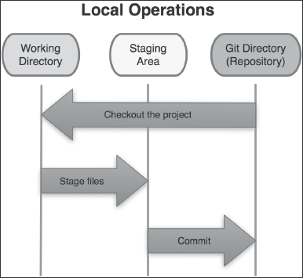

import { WarningBox } from '../../../components/boxes/WarningBox';
import { ImageWithCaption } from '../../../components/ImageWithCaption';

If you're new to [Git](http://git-scm.com/) or want to know a little more about its basics and its distributed
model, do not hesitate to read my [Introduction to Git](/blog/introducing-git/).

<WarningBox>
  If you're new to Git don't try to run the commands showed in this article, they have missing
  parameters. This article was written to be a conceptual explanation about the Git workflow.
  Playing with its commands to better understand its concepts is the subject of the next article:
  [Git Basic Commands Explained](/blog/git-basic-commands-explained/), which I recommend you read
  next.
</WarningBox>

#### The Three File States

[Git](http://git-scm.com/) works with the concept of three different file states: [_committed_](/blog/git-workflow/#committed-files), [_modified_](/blog/git-workflow/#modified-files) and [_staged_](/blog/git-workflow/#staged-files) (Chacon 8).
Each state relates to a specific Git section: [_working directory_](/blog/git-workflow/#working-directory), [_staging area_](/blog/git-workflow/#staging-area) and [_Git directory_](/blog/git-workflow/#git-directory) (repository) (Chacon 8).
Additionally, any new file you add to the [_working directory_](/blog/git-workflow/#working-directory) is an [_untracked file_](/blog/git-workflow/#untracked-files), which means the file doesn't exist in the repository.

When you create a new repository from scratch running `$ git init` in an empty directory, your [_working directory_](/blog/git-workflow/#working-directory) (the physical directory that the files reside on your local machine) is empty.
And if you `$ git clone` some remote repository, your [_working directory_](/blog/git-workflow/#working-directory) is fully synchronized with the [_Git directory_](/blog/git-workflow/#git-directory) (repository).
Thereafter, any changes you make on any file automatically puts it in a [_modified_](/blog/git-workflow/#modified-files) state.
If you add new files, those will be [_untracked_](/blog/git-workflow/#untracked-files).
At this time (with modified and/or untracked files), trying to run `$ git commit` to send files from the [_working directory_](/blog/git-workflow/#working-directory) to the local repository ([_Git directory_](/blog/git-workflow/#git-directory)) will have no effect.
Git only send files that are in the [_staged_](/blog/git-workflow/#staged-files) state, which conceptually resides in the [_staging area_](/blog/git-workflow/#staging-area), to the repository.
So, before running `$ git commit` you must run `$ git add` to stage files and directories.
When you _add_ files, they go from [_modified_](/blog/git-workflow/#modified-files) (or [_untracked_](/blog/git-workflow/#untracked-files)) state to [_staged_](/blog/git-workflow/#staged-files) ([_staging area_](/blog/git-workflow/#staging-area)) state.
After that, running `$ git commit` will change the state of the files from [_staged_](/blog/git-workflow/#staged-files) to [_committed_](/blog/git-workflow/#committed-files), leaving the [_staging area_](/blog/git-workflow/#staging-area) and going to the [_Git directory_](/blog/git-workflow/#git-directory) (repository).
Each `$ git commit` represents a snapshot of the project.

<ImageWithCaption caption="Git Workflow (Chacon 8)">
  
</ImageWithCaption>

<WarningBox>
  When you run `$ git add`, Git sends a _snapshot_ of the file to the [_staging
  area_](/blog/git-workflow/#staging-area), not a _reference_ of the file itself, which means if you
  change that file again after _adding_ and before _commiting_, that change is not in the [_staging
  area_](/blog/git-workflow/#staging-area). In such case you need to run `$ git add` again for that
  same file. This is an important detail and illustrates how Git works with the snapshot concept.
</WarningBox>

#### Summary

###### Working directory

_Working directory_ is your local physical directory, where you make changes to your files.

###### Staging area

_Staging area_ is a place where Git keeps a reference of all modifications (snapshot of files) to be sent in the next _commit_.

###### Git directory

_Git directory_ is the repository, the Git database which stores all files in a compressed form.

###### Untracked files

_Untracked files_ exist only in your working directory, i.e., they don't exist in the _Git directory_.

###### Modified files

_Modified files_ exist in both your _working directory_ and your _Git directory_, but they have different versions, i.e., the _working directory_ files were changed, but those changes weren't sent to the _stagging area_ by running `$ git add`.

###### Staged files

_Staged files_ exist in your _working directory_, and a) in the _Git directory_ if they are existing files being changed, or b) do not exist in the _Git directory_ if they are new files being added to the repository for the first time.

###### Committed files

_Committed files_ exist in both your _working directory_ and _Git directory_ with the exact same version.

You can run `$ git status` at any time to check the state of your files.

Phew! That was a bit complex, and a pretty much theoretical explanation.
Don't worry if things seem a little confusing right now.
It'll make a lot more sense once we start playing with the commands in practice, which is the subject of the next Git article: [Git Basic Commands Explained](/blog/git-basic-commands-explained/), which I recommend you read next.

#### Related Posts

[Git Basic Commands Explained](/blog/git-basic-commands-explained/) 
[Git Branching and Merging](/blog/git-branching-and-merging/) 
[Git Remote and Tracking Branches](/blog/git-remote-and-tracking-branches/) 
[Git Tagging](/blog/git-tagging/) 
[Introduction to Git](/blog/introducing-git/)

#### Interesting Links

[Git](http://git-scm.com/) 
[Pro Git Book](https://git-scm.com/book/en/v2)

#### Bibliography

Chacon, Scott. _Pro Git_. Apress, 2009.
