import { AITools } from '../../../components/boxes/AITools';
import { ImageWithCaption } from '../../../components/ImageWithCaption';
import { InfoBox } from '../../../components/boxes/InfoBox';
import { SocialMediaShareButtons } from '../../../components/social-media-share/SocialMediaShareButtons';

### Table of Contents

- [TLDR](#tldr)
- [Introduction](#introduction)
- [React Server Components, Server Actions, and Suspense](#react-server-components-server-actions-and-suspense)
- [Building an application to test it all](#building-an-application-to-test-it-all)
- [What application to build?](#what-application-to-build)
- [Introducing OpenTask](#introducing-opentask)
  - [Key Features](#key-features)
    - [Authentication](#authentication)
    - [Projects](#projects)
    - [Tasks](#tasks)
    - [Today](#today)
- [Technology Stack](#technology-stack)
  - [TypeScript](#typescript)
  - [React 18](#react-18)
  - [Next.js App Router (v14+)](#nextjs-app-router-v14)
  - [Tailwind CSS](#tailwind-css)
  - [Radix UI](#radix-ui)
  - [Headless UI](#headless-ui)
  - [Sizzy Browser](#sizzy-browser)
  - [Supabase + Postgres](#supabase--postgres)
  - [Prisma ORM](#prisma-orm)
  - [MDX](#mdx)
  - [next-pwa](#next-pwa)
  - [Webpack](#webpack)
  - [Other dependencies](#other-dependencies)
- [Development methodology](#development-methodology)
- [Sitemap](#sitemap)
- [OpenTask's application architecture](#opentasks-application-architecture)
- [OpenTask's implementation](#opentasks-implementation)
  - [Database](#database)
  - [\<RootLayout\>](#rootlayout)
  - [Marketing pages and components](#marketing-pages-and-components)
    - [\<MarketingLayout\>](#marketinglayout)
    - [Landing page](#landing-page)
  - [Authentication pages and components](#authentication-pages-and-components)
    - [\<AuthLayout\>](#authlayout)
    - [Authentication functionality](#authentication-functionality)
    - [Middleware](#middleware)
    - [AuthDataAccess.ts](#authdataaccessts)
    - [\<SignInPage\>](#signinpage)
  - [\<AppLayout\>](#applayout)
  - [\<MainMenu\>](#mainmenu)
  - [\<MainMenuDialogPage\>](#mainmenudialogpage)
  - [Onboarding page](#onboarding-page)
  - [Project pages and components](#project-pages-and-components)
    - [\<NewProjectDialogPage\> and \<NewProjecPage\>](#newprojectdialogpage-and-newprojecpage)
    - [\<EditProjectDialogPage\> and \<EditProjectPage\>](#editprojectdialogpage-and-editprojectpage)
    - [\<ProjectForm\>](#projectform)
      - [\<Form\>](#form)
      - [\<FormErrorList\>](#formerrorlist)
      - [\<SubmitButton\>](#submitbutton)
      - [Data validation](#data-validation)
      - [Improved experience building forms](#improved-experience-building-forms)
      - [Thrid-party form libraries](#thrid-party-form-libraries)
    - [createProject()](#createproject)
    - [\<ActiveProjectsPage\> and \<ArchivedProjectsPage\>](#activeprojectspage-and-archivedprojectspage)
    - [Recapt \<MainMenu\>](#recapt-mainmenu)
    - [Using \<Suspense\> to stream \<ProjectList\>](#using-suspense-to-stream-projectlist)
    - [\<ProjectList\> and \<ProjectListItem\>](#projectlist-and-projectlistitem)
    - [getProjects()](#getprojects)
    - [\<ProjectPage\>](#projectpage)
      - [Listing the project's tasks](#listing-the-projects-tasks)
  - [Task pages and components](#task-pages-and-components)
    - [\<TaskList\> and \<TaskListItem\>](#tasklist-and-tasklistitem)
    - [getTasks()](#gettasks)
    - [\<AddTask\>, \<NewTaskDialogPage\>, and \<NewTaskPage\>](#addtask-newtaskdialogpage-and-newtaskpage)
    - [\<TaskDialogPage\> and \<TaskPage\>](#taskdialogpage-and-taskpage)
    - [\<TaskForm\>](#taskform)
    - [createTask()](#createtask)
  - [\<TodayPage\>](#todaypage)
    - [Use case A: The user has no projects (so no tasks)](#use-case-a-the-user-has-no-projects-so-no-tasks)
    - [Use case B: The user has no tasks overdue nor due today](#use-case-b-the-user-has-no-tasks-overdue-nor-due-today)
    - [Use case C: The user has tasks due today and no overdue tasks](#use-case-c-the-user-has-tasks-due-today-and-no-overdue-tasks)
    - [Use case D: The user has tasks due today and overdue](#use-case-d-the-user-has-tasks-due-today-and-overdue)
    - [Use case E: The user has tasks overdue and no tasks due today](#use-case-e-the-user-has-tasks-overdue-and-no-tasks-due-today)
    - [Implementing the use cases](#implementing-the-use-cases)
  - [Not every implementation detail is covered](#not-every-implementation-detail-is-covered)
- [Conclusion](#conclusion)
- [Engineering improvements](#engineering-improvements)
  - [Test suite](#test-suite)
  - [Improvements at the repository level](#improvements-at-the-repository-level)
  - [Improvements at the application level](#improvements-at-the-application-level)
- [Join the project](#join-the-project)
- [Related posts](#related-posts)
- [Interesting links](#interesting-links)

### TLDR

In this article, you'll learn how I fully embraced the new React 18 and Next.js App Router features, including React Server Components, Server Actions, and Suspense, to build a full-stack hybrid web application that has never been possible, eliminating whole layers of code including no client-side data fetching, replaced by a more straightforward and faster server-side data fetching, no client-side state management, and no server-side API.

The resulting application is [OpenTask](https://opentask.app/): a free, [open-source](https://github.com/flsilva/opentask), fully functional, and responsive PWA MVP.

Let's see how to combine those features to build OpenTask, with plenty of code snippets and screenshots to investigate.

<div style={{ width: '100%', flexDirection: 'row', justifyContent: 'center' }}>
  <div style={{ maxWidth: '280px', flexGrow: 1 }}>
    <ImageWithCaption caption="Project Page on iPhone">
      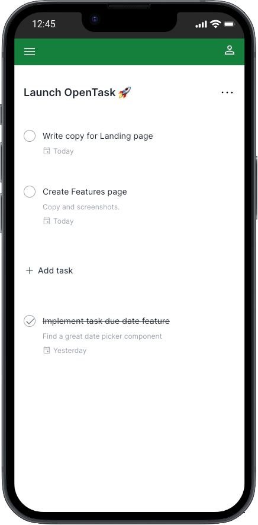
    </ImageWithCaption>
  </div>
</div>

<div style={{ width: '100%', flexDirection: 'row', justifyContent: 'center' }}>
  <div style={{ maxWidth: '720px', flexGrow: 1 }}>
    <ImageWithCaption caption="Project Page on iPad">
      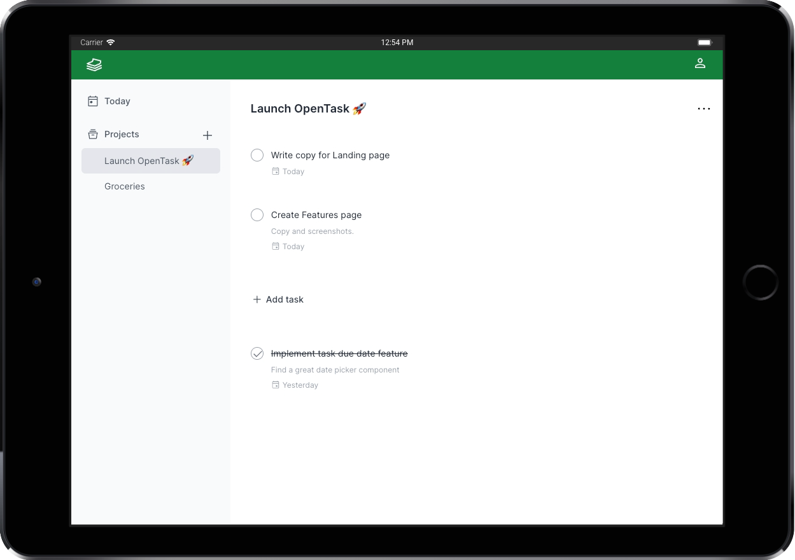
    </ImageWithCaption>
  </div>
</div>

### Introduction

In this article, I assume you're familiar with the new [Next.js App Router](https://nextjs.org/docs/app). If you're not, you can go through the new and excellent [Next.js 14 Learn course](https://nextjs.org/learn) before proceeding.

Over time, web applications have become increasingly sophisticated. Fast initial page loading scalable to millions of users, search engine optimization, responsive and intuitive user interfaces that work on different devices and screen sizes, and instant data updates are some of the features that users have come to expect, and brands that deliver them are the most successful.

Nevertheless, providing all those features can become quite expensive. To address this challenge, teams rely on frameworks that continuously innovate to abstract away complex problems, reduce costs, and free up resources to create even more engaging user experiences.

In the first half of 2023, [Vercel](https://vercel.com/) released [Next.js v13.4](https://nextjs.org/blog/next-13-4), making the new [App Router](https://nextjs.org/docs/app) and [React Server Components (RSCs)](/blog/react-server-components-and-a-new-hybrid-web-app-model/) stable, and making [Server Actions](/blog/react-server-components-and-a-new-hybrid-web-app-model/#server-actions) available in alpha. Later, in October 2023, Vercel released [Next.js v14.0](https://nextjs.org/blog/next-14), making Server Actions stable.

Those new features represent a major technological innovation that has taken React and Next.js teams several years to research and develop. As [Andrew Clark put it](https://www.youtube.com/watch?v=NiknNI_0J48&t=1944s&ab_channel=Vercel), that's the real React 18 release, and those new features are the primitives that will unfold the next layer of innovation for React apps, unlocking a new hybrid web application model.

### React Server Components, Server Actions, and Suspense

React Server Components, Server Actions, and Suspense are at the forefront of the new Next.js App Router, giving birth to this new hybrid web application model, which I fully embraced to build OpenTask.

To understand how and why we got here and what problems they solve alongside the new Next.js App Router, please read my article [React Server Components and a new hybrid web app model](https://flsilva.com/blog/react-server-components-and-a-new-hybrid-web-app-model/).

That article provides a solid conceptual foundation for those new features and officially introduces this case study, so I assume you read it before proceeding.

### Building an application to test it all

This new hybrid web app model sounds fantastic, and I was very excited to try the new Next.js App Router to see if it delivers on its promises. Does it solve real-world problems significantly better? How can I find out?

Well, there's no better way than building a real-world web application from the ground up.

I was sold. I just had to decide on what to build! 😅

### What application to build?

After weighing different options, including one involving AI, I decided to keep it simple and build a task management app that is fully functional and responsive. With a short timeline in mind, this was the perfect experiment.

A task management app is well-known and simple enough to build as part of a case study. Nonetheless, it includes common features in most apps, such as authentication, data fetching, data mutation, data (model) relationships, and UI elements like forms and dialogs.

Of course, I also added a hint of our beloved Date Picker, and voila! [OpenTask](https://opentask.app/) was born! 🎉

Let's get to know it.

### Introducing OpenTask

[OpenTask](https://opentask.app/) is a task management solution to help you structure your projects and tasks efficiently. With OpenTask, you can break your to-dos into small, actionable tasks and add them to appropriate projects, setting due dates and maintaining focus on one task at a time. It offers a dedicated _Today_ page to keep you on track, helping you prioritize your next steps.

It's a stripped-down version of [Todoist](https://todoist.com/), and the design is also based on it.

Check out OpenTask's [features page](https://opentask.app/features) for a brief explanation with screenshots.

#### Key Features

##### Authentication

Users can create an account and authenticate effortlessly and securely, choosing from four [OAuth](https://en.wikipedia.org/wiki/OAuth) providers: Google, GitHub, X, and LinkedIn.

If they decide to leave, deleting an account is a straightforward process from the _Settings_ page, and all user data is permanently removed from the database upon deletion.

##### Projects

To create tasks, users must first create projects to which tasks are added.

Projects have a mandatory name and an optional description, and they can be deleted or archived when they're no longer active.

The _Project_ page lists all tasks, completed and uncompleted, ensuring easy access to project-related tasks.

Archived projects are readily accessible from the _Archived Projects_ page, allowing users to unarchive them when needed.

##### Tasks

Tasks form the backbone of any task management application, enabling users to manage their to-dos effectively.

Each task belongs to a specific project and includes a mandatory name, an optional description, and an optional due date to help users prioritize their work.

Tasks can be completed or deleted.

The _Task_ page displays task data in a Dialog.

##### Today

The _Today_ page simplifies daily task management. Users can view tasks due today alongside any overdue tasks, providing a clear roadmap for their day.

### Technology Stack

The following is the set of tools used to build OpenTask and a brief description of each one:

#### TypeScript

[TypeScript](https://www.typescriptlang.org/) significantly improves JavaScript for creating high-quality, scalable, and maintainable codebases. JavaScript is a permissive language that makes it hard for developers to avoid different classes of bugs.

I've been using TypeScript since 2018 and find it incredibly helpful. I've extensively used it in OpenTask and am satisfied with its clean and typed codebase.

#### React 18

I have experience working with various frontend frameworks, from [Backbone.js](https://backbonejs.org/) (2012) to [AngularJS](https://angularjs.org/) v1 (2013-2016). However, I immediately fell in love when I started using [React](https://react.dev/) by the end of 2016. Its component-based architecture, one-way data flow, and functional programming approach made it much easier yet more powerful to handle the complexity of creating modern user interfaces.

I also appreciate React's direction with its React 18 release, which includes features like [React Server Components](/blog/react-server-components-and-a-new-hybrid-web-app-model/), [Server Actions](/blog/react-server-components-and-a-new-hybrid-web-app-model/#server-actions), and [Suspense & Streaming](/blog/react-server-components-and-a-new-hybrid-web-app-model/#suspense--streaming), all leveraged by OpenTask, making React a versatile full-stack component-based solution.

#### Next.js App Router (v14+)

[Next.js](https://nextjs.org/) has established itself as the go-to framework for building web applications in React. Since its creation in 2016, it has continually evolved, undergoing substantial enhancements to support the ever-expanding demands of modern web development.

The recent collaboration between the React and Next.js teams has accelerated the pace of innovation and helped the React team design server-side features that are now implemented by the new Next.js App Router, including React Server Components, Server Actions, Suspense, and Streaming.

#### Tailwind CSS

[Tailwind CSS](https://tailwindcss.com/) is a utility-first CSS framework that simplifies web development by providing pre-built, highly customizable CSS utility classes. These classes allow developers to rapidly prototype and implement user interfaces without writing custom CSS. This results in a faster feedback loop for developers, who no longer need to leave their HTML files or components.

I'm a big fan of CSS-in-JS, and OpenTask was the first time I used Tailwind CSS. I had a hard time looking at all those awkward CSS class names scattered throughout HTML elements. I couldn't understand why so many great engineers liked it. But when I started OpenTask, there was no official support from any CSS-in-JS solution for the recently stable Next.js App Router. At that point, in June 2023, Tailwind seemed the only viable option alongside CSS modules.

To my surprise, I'm happy I gave it a shot. Like any tool, it comes with trade-offs, but in my experience, the advantages far outweigh the disadvantages. What stood out to me was how remarkably efficient it can be to focus solely on HTML markup + add/remove those pre-designed utility classes directly into the markup, eliminating the need for a whole CSS code layer. Other benefits include avoiding conflicts with different components when updating shared CSS code and the ability to reuse HTML/JSX code without worrying about the CSS counterpart.

#### Radix UI

[Radix](https://www.radix-ui.com/) is a fantastic open-source React component library optimized for fast development, easy maintenance, and accessibility.

I'm using the [Dialog](https://www.radix-ui.com/primitives/docs/components/dialog), [Alert Dialog](https://www.radix-ui.com/primitives/docs/components/alert-dialog), and [Select](https://www.radix-ui.com/primitives/docs/components/select) Radix components in OpenTask.

#### Headless UI

[Headless UI](https://headlessui.com/) is an open-source collection of customizable, accessible, and unstyled UI components developed by [Tailwind Labs](https://tailwindui.com/) to integrate seamlessly with Tailwind CSS.

I'm using the [Menu](https://headlessui.com/react/menu), [Switch](https://headlessui.com/react/switch), and [Transition](https://headlessui.com/react/transition) Headless UI components in OpenTask.

I wanted to try them, and they're excellent components. However, I'll migrate the Menu (Dropdown) and Switch components to Radix to have a consistent codebase and keep using only the Transition component from Headless UI.

#### Sizzy Browser

[Sizzy](https://sizzy.co/) is a web browser for developers and designers. It offers a range of features tailored to help them efficiently test and debug responsive web designs.

With Sizzy, developers and designers can view their websites in multiple device sizes and orientations simultaneously, making it easier to implement, tweak, and fix responsive web design issues, saving hours of development time.

#### Supabase + Postgres

[Supabase](https://supabase.com/) is a fantastic open-source platform that simplifies [Postgres](https://www.postgresql.org/) database management, positioning itself as a [Firebase](https://firebase.google.com/) alternative. It offers features like [authentication](https://supabase.com/docs/guides/auth), [real-time data synchronization](https://supabase.com/docs/guides/realtime), and [Edge Functions](https://supabase.com/docs/guides/functions), making creating robust and dynamic applications more accessible.

Supabase is the database and authentication provider for OpenTask.

#### Prisma ORM

[Prisma](https://www.prisma.io/) is an open-source [Object-Relational Mapping](https://en.wikipedia.org/wiki/Object%E2%80%93relational_mapping) (ORM) tool developers use to simplify database queries in JavaScript and TypeScript instead of writing raw SQL queries. Prisma automates many everyday database tasks, making handling data models, migrations, and database operations easier while ensuring type safety (when using TypeScript) in your application's data layer.

Prisma has fantastic features, including its simple and clean schema DSL to define your application's models and its migration tool to create and change your database tables based on your schema.

[Drizzle](https://orm.drizzle.team/) is an alternative to Prisma that seems excellent, and I'm looking forward to testing it.

#### MDX

[MDX](https://mdxjs.com/) is an extension to [Markdown](https://www.markdownguide.org/) that lets you include JSX in Markdown documents, effectively allowing you to embed and render React components and dynamic JavaScript code within your documents.

I've used MDX to build some of the marketing pages of OpenTask.

#### next-pwa

[next-pwa](https://github.com/DuCanhGH/next-pwa) is a JavaScript library used to add [Progressive Web App](https://web.dev/progressive-web-apps/) (PWA) capabilities to applications built with Next.js. PWAs are web applications that offer improved performance and offline functionality, and next-pwa simplifies the process of making a Next.js application into a PWA, helping developers add features like caching, service workers, and offline support.

The next-pwa library makes it incredibly easy to add many PWA features with zero config. I haven't added offline support for OpenTask, though.

#### Webpack

[Webpack](https://webpack.js.org/) is the most popular JavaScript module bundler. It simplifies the process of managing and organizing the various components of a web application. It takes different pieces of code, such as JavaScript files, CSS files, and images, and bundles them into optimized and efficient web deployment packages. It's the default bundler when using Next.js.

[Turbopack](https://turbo.build/pack) is the successor to Webpack. The goal is to make bundling as fast as a few milliseconds, improving the Developer Experience with instant code updates, refreshes, and faster production builds, increasing productivity. I'm still waiting to use Turbopack on OpenTask, but I look forward to moving to it when 100% [of the tests pass](https://areweturboyet.com/).

#### Other dependencies

- Date Picker: [react-day-picker](https://react-day-picker.js.org/);
- Date manipulation: [date-fns](https://date-fns.org/);
- Time zone support: [date-fns-tz](https://github.com/marnusw/date-fns-tz);
- Text editing: [react-contenteditable](https://github.com/lovasoa/react-contenteditable);
- Sanitization: [isomorphic-dompurify](https://github.com/kkomelin/isomorphic-dompurify);
- Data schema declaration and validation: [zod](https://zod.dev/);
- Unique identifiers: [cuid2](https://github.com/paralleldrive/cuid2);
- User-agent parsing: [ua-parser-js](https://github.com/faisalman/ua-parser-js);

### Development methodology

Developing OpenTask as a solo project allowed me to be flexible in the development approach.

I started building the user interface components and assembling them, developing the marketing and authentication pages and then the internal app pages in a responsive way.

That approach allowed me to move faster by initially focusing solely on solving UI problems.

After establishing a solid component-based UI foundation, the development transitioned to building backend services and integrating them with the front end. This phase introduced distinct challenges as the app evolved into a fully functional solution, enabling user authentication and data input to persist in the database.

For a full-stack engineer, witnessing the seamless interaction of various technologies and components of a modern web app is rewarding.

In the closing weeks, attention turned to integrating a Progressive Web App (PWA) solution, refining the UI, and addressing remaining issues.

After I finished building the MVP, I kept learning more about React Server Components and this new hybrid web application model and refactored the code several times to get to the present version.

### Sitemap

Before we delve into the application architecture and implementation, let's look at all the currently available URLs to give you an overview of the application as a whole.

You can find the product at [https://opentask.app](https://opentask.app/).

```shell
# Marketing and legal URLs:

/
/about
/features
/pricing
/privacy
/terms

# Auth URLs:

/auth/sign-in
/auth/sign-in/check-email-link
/auth/callback

# App URLs:

/app/main-menu

/app/onboarding

/app/today

/app/projects/[projectId]
/app/projects/[projectId]/edit
/app/projects/active
/app/projects/archived
/app/projects/new

/app/tasks/[taskId]
/app/tasks/new

/app/settings/account
```

### OpenTask's application architecture

I've put together different modular and layered application architectures in the past. When I developed OpenTask, I designed a custom-tailored application architecture for apps built with the new Next.js App Router. It's called [Nexar](https://nexar.dev/), and OpenTask is its reference implementation.

Before reading OpenTask's implementation next, I strongly encourage you to read the [Nexar docs](https://nexar.dev/learn). I use OpenTask's codebase to explain Nexar, and by reading the Nexar docs you'll thoroughly understand OpenTask's application architecture and modules alongside Nexar itself, which you can adopt in the Next.js App Router apps you build.

### OpenTask's implementation

In the following sections, I'll explain how I implemented several pages and components of OpenTask to leverage the new React 18 and Next.js App Router features, including React Server Components, Server Actions, and Suspense.

I'll show several code snippets, but not everything. Feel free to browse the codebase to look into further details. Remember that this article discusses the codebase as is in the [feb-2024 branch](https://github.com/flsilva/opentask/tree/feb-2024).

I plan to make only minor changes to that branch in the future so that future readers can still browse it as they follow this article.

I plan to keep working on the codebase from the main branch and writing new posts about relevant changes.

#### Database

OpenTask uses [Supabase](https://supabase.com/) as the [Postgres](https://www.postgresql.org/) database provider and [Prisma](https://www.prisma.io/) as the [ORM](https://en.wikipedia.org/wiki/Object%E2%80%93relational_mapping) tool.

Even though Supabase offers a [database migration solution](https://supabase.com/docs/reference/cli/supabase-migration), i.e., a way to create and update database tables, I love [Prisma Migrate](https://www.prisma.io/docs/concepts/components/prisma-migrate) and its clean [schema DSL](https://www.prisma.io/docs/concepts/components/prisma-schema) to handle migrations ([Prisma Schema Language](https://www.prisma.io/docs/orm/prisma-schema/overview#syntax)).

The [_`prisma/schema.prisma`_](https://github.com/flsilva/opentask/blob/feb-2024/prisma/schema.prisma) file defines the three database tables in OpenTask: _`User`_, _`Project`_, and _`Task`_.

Here's the entire code for it:

```prisma schema.prisma
datasource db {
  provider  = "postgresql"
  url       = env("DATABASE_URL")
  directUrl = env("DATABASE_DIRECT_URL")
}

generator client {
  provider = "prisma-client-js"
}

// We use Supabase's authentication solution, which creates users in a private "auth" schema.
// To query users from the app, we create this User table in the "public" schema.
// We add users to it after they're created by Supabase's auth solution, using the same "id"
// generated by Supabase's auth solution.
model User {
  id            String    @id @db.Uuid
  email         String    @unique @db.VarChar(254)
  name          String?   @db.VarChar(500)
  projects      Project[]
  provider      String?   @db.VarChar(100)
  tasks         Task[]
  timeZone      String?   @db.VarChar(100)
  createdAt     DateTime  @default(now())
  updatedAt     DateTime? @updatedAt
}

model Project {
  id            String    @id @db.VarChar(32)
  name          String    @db.VarChar(500)
  description   String?   @db.VarChar(2000)
  archivedAt    DateTime?
  author        User      @relation(fields: [authorId], references: [id], onDelete: Cascade)
  authorId      String    @db.Uuid
  tasks         Task[]
  createdAt     DateTime  @default(now())
  updatedAt     DateTime? @updatedAt

  @@index([archivedAt, authorId])
}

model Task {
  id            String    @id @db.VarChar(32)
  name          String    @db.VarChar(500)
  description   String?   @db.VarChar(2000)
  dueDate       DateTime?
  completedAt   DateTime?
  project       Project   @relation(fields: [projectId], references: [id], onDelete: Cascade)
  projectId     String    @db.VarChar(32)
  author        User      @relation(fields: [authorId], references: [id], onDelete: Cascade)
  authorId      String    @db.Uuid
  createdAt     DateTime  @default(now())
  updatedAt     DateTime? @updatedAt

  @@index([authorId, completedAt, dueDate, projectId])
}
```

OpenTask has two databases (Supabase projects): a production one reflecting changes in the _`main`_ branch and a staging one used for testing any branch other than _`main`_, used for building and testing new features and changing existing ones before deploying them to production.

That, alongside Vercel Previews, provides a complete staging environment for team testing, experimenting, and work review.

For [local development](https://supabase.com/docs/guides/cli), Supabase provides a simple way to run a local database using [Docker](https://www.docker.com/).

That setup gives enough flexibility and scalability for small teams to keep evolving the app after its launch.

#### \<RootLayout\>

File: [_`src/app/layout.tsx`_](https://github.com/flsilva/opentask/blob/feb-2024/src/app/layout.tsx)

[_`<RootLayout>`_](https://github.com/flsilva/opentask/blob/feb-2024/src/app/layout.tsx) is a Server Component containing the _`<html>`_ and _`<body>`_ tags alongside metatags for indexing and PWA features.

Here's a simplified version of it:

```tsx layout.tsx
import { Suspense } from 'react';
import { GaNextScriptNavigation } from '@/features/shared/routing/GoogleAnalytics';
import { InstallPwaProvider } from '@/features/shared/ui/pwa/InstallPwaProvider';

export default function RootLayout({ children }: { children: React.ReactNode }) {
  return (
    <html lang="en">
      <body>
        <InstallPwaProvider>{children}</InstallPwaProvider>
        <Suspense>
          <GaNextScriptNavigation gaId="your-ga-id-here" />
        </Suspense>
      </body>
    </html>
  );
}
```

It renders a [_`<InstallPwaProvider>`_](https://github.com/flsilva/opentask/blob/feb-2024/src/features/shared/ui/pwa/InstallPwaProvider.tsx) [Client Component](/blog/react-server-components-and-a-new-hybrid-web-app-model/#what-are-client-components), responsible for [_`createContext()`_](https://react.dev/reference/react/createContext) and [providing it](https://react.dev/reference/react/createContext#provider) with a [_`BeforeInstallPromptEvent.prompt()`_](https://developer.mozilla.org/en-US/docs/Web/API/BeforeInstallPromptEvent/prompt) function that we can call when we find it appropriate. In OpenTask, we do that in the [_`<AppLayout>`_](https://github.com/flsilva/opentask/blob/feb-2024/src/app/app/layout.tsx) (further explained).

It also renders a [_`<GaNextScriptNavigation>`_](https://github.com/flsilva/opentask/blob/feb-2024/src/features/shared/routing/GoogleAnalytics.tsx#L66) Client Component, a utility I created to set Google Analytics' _`<script>`_ and track visited pages automatically, so we don't have to worry about Google Analytics in any other part of the codebase.

Since we use Next.js' [_`useSearchParams()`_](https://nextjs.org/docs/app/api-reference/functions/use-search-params) function in [_`<GaNextScriptNavigation>`_](https://github.com/flsilva/opentask/blob/feb-2024/src/features/shared/routing/GoogleAnalytics.tsx#L66), we have to wrap it in [_`<Suspense>`_](https://react.dev/reference/react/Suspense) to avoid getting the following error at build time:

```shell
useSearchParams() should be wrapped in a suspense boundary at page "/app/(.)projects".
Read more: https://nextjs.org/docs/messages/missing-suspense-with-csr-bailout
```

#### Marketing pages and components

Routing module: [_`src/app/(marketing)`_](<https://github.com/flsilva/opentask/tree/feb-2024/src/app/(marketing)>)<br />
Feature module: [_`src/features/marketing/`_](https://github.com/flsilva/opentask/tree/feb-2024/src/features/marketing/)

The following is the folder structure of the [_`src/app/(marketing)`_](<https://github.com/flsilva/opentask/tree/feb-2024/src/app/(marketing)>) **routing module**, defining marketing and legal route segments:

```shell
src/app/(marketing)/layout.tsx

src/app/(marketing)/page.tsx
src/app/(marketing)/about/page.mdx
src/app/(marketing)/features/page.tsx
src/app/(marketing)/pricing/page.tsx
src/app/(marketing)/privacy/page.mdx
src/app/(marketing)/terms/page.mdx
```

The following is the folder structure of the [_`src/features/marketing/`_](https://github.com/flsilva/opentask/tree/feb-2024/src/features/marketing/) **business feature** module:

```shell
shared/ui/Footer.tsx
shared/ui/Header.tsx
shared/ui/HeroCopy.tsx
shared/ui/HeroHeading.tsx
shared/ui/MainMenu.tsx
shared/ui/MainMenuMobile.tsx
shared/ui/ShowContentTransition.tsx
```

<InfoBox>
  I explain routing and business feature modules, alongside other codebase conventions you'll see in
  the following sections, in [Nexar](https://nexar.dev), the application architecture OpenTask
  implements. If you haven't read it, please do so now, as it'll help you understand OpenTask's
  implementation more easily and quickly. I explain Nexar with OpenTask's codebase, so you'll learn
  both simultaneously.
</InfoBox>

##### \<MarketingLayout\>

File: [_`src/app/(marketing)/layout.tsx`_](<https://github.com/flsilva/opentask/blob/feb-2024/src/app/(marketing)/layout.tsx>)

We define a _`(marketing)`_ [Route Group](https://nextjs.org/docs/app/building-your-application/routing/route-groups) in the routing module to implement a [_`<MarketingLayout>`_](<https://github.com/flsilva/opentask/blob/feb-2024/src/app/(marketing)/layout.tsx>) Server Component that wraps marketing and legal pages only and is wrapped by [_`<RootLayout>`_](https://github.com/flsilva/opentask/blob/feb-2024/src/app/layout.tsx).

Here's the entire code for [_`<MarketingLayout>`_](<https://github.com/flsilva/opentask/blob/feb-2024/src/app/(marketing)/layout.tsx>):

```tsx layout.tsx
import '../globals.css';
import { Header } from '@/features/marketing/shared/ui/Header';
import { Footer } from '@/features/marketing/shared/ui/Footer';

export default function MarketingLayout({ children }: { children: React.ReactNode }) {
  return (
    <>
      <div className="flex flex-1 flex-col bg-white">
        <Header />
        <div className="relative px-6 lg:px-8">
          <div className="mx-auto max-w-2xl">
            <div className="text-center mb-20">{children}</div>
          </div>
        </div>
      </div>
      <Footer />
    </>
  );
}
```

[_`<Header>`_](https://github.com/flsilva/opentask/blob/feb-2024/src/features/marketing/shared/ui/Header.tsx) is a Client Component that [_`useState()`_](https://react.dev/reference/react/useState) to render a [_`<MainMenuMobile>`_](https://github.com/flsilva/opentask/blob/feb-2024/src/features/marketing/shared/ui/MainMenuMobile.tsx) conditionally when we click the hamburger menu button.

[_`<Footer>`_](https://github.com/flsilva/opentask/blob/feb-2024/src/features/marketing/shared/ui/Footer.tsx) is a [Shared Component](/blog/react-server-components-and-a-new-hybrid-web-app-model/#what-are-shared-components) that renders static HTML only.

##### React Server Components as a static site generation (SSG) tool

<InfoBox>
We should use Server Components as much as possible due to their numerous benefits, including zero impact on bundle size and server-side data fetching, [moving Client Components down the tree](https://nextjs.org/docs/app/building-your-application/rendering/composition-patterns#moving-client-components-down-the-tree).

In Next.js App Router, Server Components render at build time by default unless you use a [dynamic function](https://nextjs.org/docs/app/building-your-application/rendering/server-components#dynamic-functions) like [cookies()](https://nextjs.org/docs/app/api-reference/functions/cookies) or [headers()](https://nextjs.org/docs/app/api-reference/functions/headers), which will opt into [dynamic rendering](https://nextjs.org/docs/app/building-your-application/rendering/server-components#dynamic-rendering).

Since we don't use any dynamic function in marketing pages, we effectively use React Server Components as a [static site generation (SSG) tool](/blog/react-server-components-and-a-new-hybrid-web-app-model/#ssg) that doesn't require a server at runtime.

</InfoBox>

All marketing and legal pages are straightforward Server Components rendering static HTML.

The [_`<Header>`_](https://github.com/flsilva/opentask/blob/feb-2024/src/features/marketing/shared/ui/Header.tsx), [_`<MainMenu>`_](https://github.com/flsilva/opentask/blob/feb-2024/src/features/marketing/shared/ui/MainMenu.tsx), [_`<MainMenuMobile>`_](https://github.com/flsilva/opentask/blob/feb-2024/src/features/marketing/shared/ui/MainMenuMobile.tsx), and [_`<ShowContentTransition>`_](https://github.com/flsilva/opentask/blob/feb-2024/src/features/marketing/shared/ui/ShowContentTransition.tsx) are the only Client Components in marketing pages, which means they're the only components React hydrates in the browser.

Server Components are rendered in the server or at build time to plain HTML and are not hydrated by React. That's why they can't have any interactivity or use any browser API.

Previously, I was redirecting authenticated users to the app (_`opentask.app/app`_) from the marketing layout, but that turns all marketing pages dynamic, waiting for server-side code to check if users are authenticated, resulting in a somewhat slow rendering of the marketing pages for not authenticated users.

I could look into optimizing it, but for now, I removed the redirect, making all marketing and legal pages static, allowing us to cache and serve them from a CDN. The sign-in page redirects users to the app when they are authenticated, as is further explained.

##### Landing page

<br />
<br />

<div style={{ width: '100%', flexDirection: 'row', justifyContent: 'center' }}>
  <div style={{ maxWidth: '280px', flexGrow: 1 }}>
    <ImageWithCaption caption="Landing Page on iPhone">
      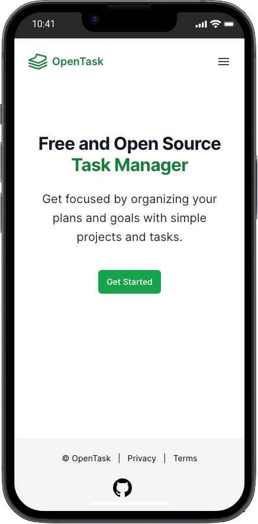
    </ImageWithCaption>
  </div>
</div>

<div style={{ width: '100%', flexDirection: 'row', justifyContent: 'center' }}>
  <div style={{ maxWidth: '720px', flexGrow: 1 }}>
    <ImageWithCaption caption="Landing Page on iPad">
      
    </ImageWithCaption>
  </div>
</div>

File: [_`src/app/(marketing)/page.tsx`_](<https://github.com/flsilva/opentask/blob/feb-2024/src/app/(marketing)/page.tsx>)

Here's the entire code for the landing page and related components:

```tsx page.tsx
import Link from 'next/link';
import { buttonGreenClassName } from '@/features/shared/ui/control/button/buttonClassName';
import { HeroCopy } from '@/features/marketing/shared/ui/HeroCopy';
import { HeroHeading } from '@/features/marketing/shared/ui/HeroHeading';
import { ShowContentTransition } from '@/features/marketing/shared/ui/ShowContentTransition';

export default function LandingPage() {
  return (
    <ShowContentTransition>
      <div className="pt-24 sm:pt-36 lg:pt-42">
        <HeroHeading>
          Free and Open Source <br />
          <span className="text-green-700">Task Manager</span>
        </HeroHeading>
        <HeroCopy>
          Get focused by organizing your plans and goals with simple projects and tasks.
        </HeroCopy>
        <div className="mt-10 flex items-center justify-center">
          <Link href="/auth/sign-in" className={buttonGreenClassName}>
            Get Started
          </Link>
        </div>
      </div>
    </ShowContentTransition>
  );
}
```

```tsx ShowContentTransition.tsx
'use client';

import { Transition } from '@headlessui/react';
import { ChildrenProps } from '@/features/shared/ui/ChildrenProps';

export const ShowContentTransition = ({ children }: ChildrenProps) => (
  <Transition
    appear
    show
    as="div"
    enter="ease-out duration-[400ms]"
    enterFrom="opacity-0 translate-y-[75px]"
    enterTo="opacity-100 translate-y-0"
    leave="ease-in duration-200"
    leaveFrom="opacity-100 translate-y-0"
    leaveTo="opacity-0 translate-y-[75px]"
  >
    {children}
  </Transition>
);
```

```tsx HeroHeading.tsx
import { ChildrenProps } from '@/features/shared/ui/ChildrenProps';

export const HeroHeading = ({ children }: ChildrenProps) => (
  <h1 className="text-3xl font-bold tracking-tight text-gray-900 sm:text-6xl sm:leading-tight">
    {children}
  </h1>
);
```

```tsx HeroCopy.tsx
import { twMerge } from 'tailwind-merge';
import { ChildrenProps } from '@/features/shared/ui/ChildrenProps';
import { ClassNamePropsOptional } from '@/features/shared/ui/ClassNameProps';

export const HeroCopy = ({ children, className }: ChildrenProps & ClassNamePropsOptional) => (
  <p className={twMerge('mt-6 text-xl leading-8 text-gray-800', className)}>{children}</p>
);
```

The other marketing pages share this same structure. Legal pages are even more straightforward.

#### Authentication pages and components

Routing module: [_`src/app/auth`_](https://github.com/flsilva/opentask/tree/feb-2024/src/app/auth)<br />
Feature module: [_`src/features/auth/`_](https://github.com/flsilva/opentask/tree/feb-2024/src/features/auth/)

The following is the folder structure of the [_`src/app/auth`_](https://github.com/flsilva/opentask/tree/feb-2024/src/app/auth) routing module, defining authentication route segments:

```shell
src/app/auth/error.tsx
src/app/auth/layout.tsx

src/app/auth/sign-in/page.tsx
app/auth/sign-in/check-email-link/page.tsx
```

The following is the folder structure of the _`src/features/auth/`_ business feature module:

```shell
data-access/AuthDataAccess.ts
data-access/OAuthProvider.ts
```

##### \<AuthLayout\>

File: [_`src/app/auth/layout.tsx`_](https://github.com/flsilva/opentask/blob/feb-2024/src/app/auth/layout.tsx)

[_`<AuthLayout>`_](https://github.com/flsilva/opentask/blob/feb-2024/src/app/auth/layout.tsx) is a Server Component that wraps authentication pages and is wrapped by [_`<RootLayout>`_](https://github.com/flsilva/opentask/blob/feb-2024/src/app/layout.tsx).

It renders a more straightforward layout for authenticated pages, rendering only the OpenTask logo instead of the _`<Header>`_ component used in the marketing pages. The _`<Footer>`_ component is the same.

##### Authentication functionality

Users authenticate using one of the [OAuth](https://en.wikipedia.org/wiki/OAuth) providers implemented in the [_`<SignInPage>`_](https://github.com/flsilva/opentask/blob/feb-2024/src/app/auth/sign-in/page.tsx) (more next).

OpenTask's authentication is based on [Supabase's authentication solution](https://supabase.com/docs/guides/auth/auth-helpers/nextjs) and implemented server-side to support React Server Components, which means it's cookies-based.

We can authenticate with email [OTP](https://en.wikipedia.org/wiki/One-time_password) (magic link) **only from localhost and preview deployment** because that's easier than setting up OAuth apps for testing. You can find instructions on how to run the app locally in the repo's [README file](https://github.com/flsilva/opentask#welcome-to-opentask).

I left out the email OTP authentication option because it doesn't work on the iPhone when running the app as a PWA, i.e., outside Safari.

When we click the OTP sign-in link from the iPhone's email app, it opens Safari and gets us signed in. However, the session is not shared with the PWA, which runs in a dedicated window, i.e., we're not signed in when we switch back to the PWA window.

It works on Android when switching from Chrome to the PWA, but we shouldn't expect users to switch back to the PWA window; that's a terrible UX.

The expected UX is clicking the OTP magic link in the email app and going directly to the PWA window to get authenticated. I couldn't make it work, though. If you did that before, please [leave a comment below](/blog/opentask-nextjs-app-router-case-study/#post-comments) or [ping me on X](https://twitter.com/flsilva7), I'd love to make it work if that's possible. I'm using [Giscus](https://giscus.app/), so you can use your GitHub account to comment.

Many mobile authentication options have great UX, but I kept it simple for the MVP.

[Clerk](https://clerk.com/) seems like an excellent authentication solution with such options, and I look forward to testing it.

##### Middleware

The [_`src/middleware.ts`_](https://github.com/flsilva/opentask/blob/feb-2024/src/middleware.ts) file leverages [Next's middleware](https://nextjs.org/docs/app/building-your-application/routing/middleware) functionality to refresh the user's session before loading Server Component routes as per [Supabase's documentation](https://supabase.com/docs/guides/auth/auth-helpers/nextjs#managing-session-with-middleware).

##### AuthDataAccess.ts

[_`AuthDataAccess.ts`_](https://github.com/flsilva/opentask/blob/feb-2024/src/features/auth/data-access/AuthDataAccess.ts) exposes two Server Actions: [_`signInWithEmail()`_](https://github.com/flsilva/opentask/blob/feb-2024/src/features/auth/data-access/AuthDataAccess.ts#L11), called only when testing email sign-in on localhost or preview deployment, and [_`signInWithOAuth()`_](https://github.com/flsilva/opentask/blob/feb-2024/src/features/auth/data-access/AuthDataAccess.ts#L31), called when signing-in with OAuth in production.

I'm using Supabase's [@supabase/auth-helpers-nextjs](https://www.npmjs.com/package/@supabase/auth-helpers-nextjs) package ([see the docs](https://supabase.com/docs/guides/auth/auth-helpers/nextjs)), but they recently released a replacement one called [@supabase/ssr](https://www.npmjs.com/package/@supabase/ssr) ([see docs here](https://supabase.com/docs/guides/auth/server-side/migrating-to-ssr-from-auth-helpers)), which they now recommend using instead.

Moving forward, I'll migrate to either [@supabase/ssr](https://www.npmjs.com/package/@supabase/ssr) or [Clerk](https://clerk.com/). I'm leaning toward Clerk, which I recommend to my clients when building commercial apps.

##### \<SignInPage\>

<br />
<br />

<div style={{ width: '100%', flexDirection: 'row', justifyContent: 'center' }}>
  <div style={{ maxWidth: '280px', flexGrow: 1 }}>
    <ImageWithCaption caption="Sign In Page on iPhone">
      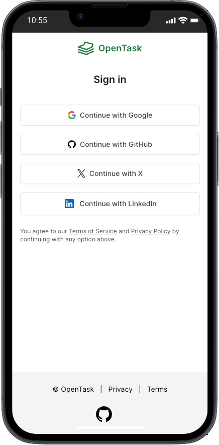
    </ImageWithCaption>
  </div>
</div>

<div style={{ width: '100%', flexDirection: 'row', justifyContent: 'center' }}>
  <div style={{ maxWidth: '720px', flexGrow: 1 }}>
    <ImageWithCaption caption="Sign In Page on iPad">
      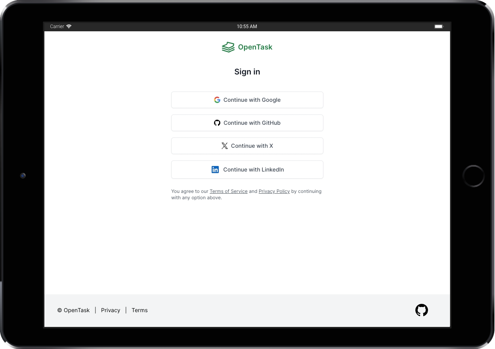
    </ImageWithCaption>
  </div>
</div>

File: [_`src/app/auth/sign-in/page.tsx`_](https://github.com/flsilva/opentask/blob/feb-2024/src/app/auth/sign-in/page.tsx)

[_`<SignInPage>`_](https://github.com/flsilva/opentask/blob/feb-2024/src/app/auth/sign-in/page.tsx) is a simple Server Component rendering, among a few other things, four [_`<OAuthProviderButton>`_](https://github.com/flsilva/opentask/blob/feb-2024/src/features/shared/ui/control/button/OAuthProviderButton.tsx) Server Components, one for each provider.

Here's a simplified version of it:

```tsx page.tsx
import { GoogleLogoIcon } from '@/features/shared/ui/icon/GoogleLogoIcon';
import { OAuthProviderButton } from '@/features/shared/ui/control/button/OAuthProviderButton';
import { OAuthProvider } from '@/features/auth/data-access/OAuthProvider';
import { signInWithOAuth } from '@/features/auth/data-access/AuthDataAccess';
...
export default async function SignInPage() {
...
  return (
    <div className="sm:mx-auto sm:w-full sm:max-w-sm">
      <OAuthProviderButton
        action={signInWithOAuth}
        provider={OAuthProvider.Google}
      >
        <GoogleLogoIcon />
        Continue with Google
      </OAuthProviderButton>
      ...
    </div>
  );
...
}
```

And here's the entire code for [_`<OAuthProviderButton>`_](https://github.com/flsilva/opentask/blob/feb-2024/src/features/shared/ui/control/button/OAuthProviderButton.tsx):

```tsx OAuthProviderButton.tsx
import { twMerge } from 'tailwind-merge';
import { OAuthProvider } from '@/features/auth/data-access/OAuthProvider';
import { ChildrenProps } from '@/features/shared/ui/ChildrenProps';
import { buttonWhiteClassName } from './buttonClassName';
import { SubmitButton } from './SubmitButton';

export interface OAuthProviderButtonProps extends ChildrenProps {
  readonly action: (formData: FormData) => void;
  readonly provider: OAuthProvider;
}

export const OAuthProviderButton = ({ action, children, provider }: OAuthProviderButtonProps) => (
  <form action={action}>
    <input type="hidden" name="provider" value={provider} />
    <SubmitButton
      className={twMerge(buttonWhiteClassName, 'mt-4 w-full')}
      labelClassName="gap-2"
      spinnerClassName="border-green-600 border-b-white"
    >
      {children}
    </SubmitButton>
  </form>
);
```

The [_`<SubmitButton>`_](https://github.com/flsilva/opentask/blob/feb-2024/src/features/shared/ui/control/button/SubmitButton.tsx) leverages [_`useFormStatus()`_](https://react.dev/reference/react-dom/hooks/useFormStatus) to display a spinner loading when _`pending === true`_.

As mentioned earlier, on localhost and preview deployment, we render a _`<form action={signInWithEmail}>`_ allowing authentication with email. When we _`npx supabase start`_, it launches [Inbucket](https://inbucket.org/) on localhost at port _`54324`_. We can then navigate to _`/monitor`_ to see incoming emails, open them, and click the _`Confirm your email address`_ link to sign in on localhost or a preview deployment. I always use email authentication on localhost and preview deployment. I didn't set up OAuth for testing.

Another important thing we do in the [_`<SignInPage>`_](https://github.com/flsilva/opentask/blob/feb-2024/src/app/auth/sign-in/page.tsx) is redirect authenticated users to the app:

```tsx page.tsx
import { redirect } from 'next/navigation';
import { isUserAuthenticated } from '@/features/app/users/UsersDataAccess';
...
export default async function SignInPage() {
  /*
   * Redirect authenticated users to the app.
   */
  const isAuthenticated = await isUserAuthenticated();
  if (isAuthenticated) redirect('/app/today');
  /**/
...
}
```

I love how easy and intuitive implementing such a redirect directly from a React component is. If we don't redirect, the component renders as usual. That's a tiny example of how amazing React Server Components are and how they seamlessly fit in a React component tree.

The downside is that [_`<SignInPage>`_](https://github.com/flsilva/opentask/blob/feb-2024/src/app/auth/sign-in/page.tsx) becomes dynamic and can't be cached and served from a CDN. But there's no way around it if we don't want to show a sign-in page for authenticated users.

#### \<AppLayout\>

File: [_`src/app/app/layout.tsx`_](https://github.com/flsilva/opentask/blob/feb-2024/src/app/app/layout.tsx)

We use the [_`<AppLayout>`_](https://github.com/flsilva/opentask/blob/feb-2024/src/app/app/layout.tsx) Server Component to compose the application layout, render _`children`_ (the target _`page.tsx`_ route segment) and _`dialog`_ (a [_named slot_](https://nextjs.org/docs/app/building-your-application/routing/parallel-routes#slots) to create an [Intercepting Route](https://nextjs.org/docs/app/building-your-application/routing/intercepting-routes) for dialogs) and redirect unauthenticated users to the authentication page.

Here's a simplified version of it:

```tsx layout.tsx
import { redirect } from 'next/navigation';
import { Header } from '@/features/app/shared/ui/Header';
import { MainMenu } from '@/features/app/shared/ui/MainMenu';
import { InstallPwaDialog } from '@/features/shared/ui/pwa/InstallPwaDialog';
import { isUserAuthenticated } from '@/features/app/users/UsersRepository';
...

export default async function AppLayout({
  children,
  dialog,
}) {
  /*
   * Redirect unauthenticated users to the authentication page.
   */
  const isAuthenticated = await isUserAuthenticated();
  if (!isAuthenticated) redirect('/auth/sign-in');
  /**/

  return (
    <div>
      <Header />
      <div>
        <MainMenu className="hidden lg:flex" />
        <div>
          {children}
          {dialog}
        </div>
      </div>
      <InstallPwaDialog />
    </div>
  );
}
```

We render a [_`<Header>`_](https://github.com/flsilva/opentask/blob/feb-2024/src/features/app/shared/ui/Header.tsx) Server Component that fetches the authenticated user object to pass its name to the [_`<SettingsMenu>`_](https://github.com/flsilva/opentask/blob/feb-2024/src/features/app/settings/ui/SettingsMenu.tsx) Client Component. That's a different [_`<Header>`_](https://github.com/flsilva/opentask/blob/feb-2024/src/features/app/shared/ui/Header.tsx) component than the marketing pages one, as you can see it imported from _`@/features/app/shared/ui/Header`_.

Here's a simplified version of [_`<Header>`_](https://github.com/flsilva/opentask/blob/feb-2024/src/features/app/shared/ui/Header.tsx):

```tsx Header.tsx
import { SettingsMenu } from '@/features/app/settings/ui/SettingsMenu';
import { getUser } from '@/features/app/users/data-access/UsersDataAccess';

export const Header = async () => {
  const user = await getUser();

  return (
    <header>
      ...
      <SettingsMenu userName={user.name} />
      ...
    </header>
  );
};
```

[_`<SettingsMenu>`_](https://github.com/flsilva/opentask/blob/feb-2024/src/features/app/settings/ui/SettingsMenu.tsx) is a Client Component, so it can't fetch the user object. It renders a [_`<PersonIcon>`_](https://github.com/flsilva/opentask/blob/feb-2024/src/features/shared/ui/icon/PersonIcon.tsx) button that renders a [_`<DropdownMenu>`_](https://github.com/flsilva/opentask/blob/feb-2024/src/features/shared/ui/control/dropdown/DropdownMenu.tsx) when clicked.

We render the app's _`<MainMenu className="hidden lg:flex" />`_ Server Component (another one, not the same as the marketing pages) only on large screens, i.e., _`@media (min-width: 1024px)`_.

For small screens, we have a hamburger menu button in the [_`<Header>`_](https://github.com/flsilva/opentask/blob/feb-2024/src/features/app/shared/ui/Header.tsx) that navigates to the _`/app/main-menu`_ route to render the same [_`<MainMenu>`_](https://github.com/flsilva/opentask/blob/feb-2024/src/features/app/shared/ui/MainMenu.tsx) component but this time fullscreen in a [_`<Dialog>`_](https://github.com/flsilva/opentask/blob/feb-2024/src/features/shared/ui/dialog/Dialog.tsx) for a better UX for mobile users.

We render a [_`<InstallPwaDialog />`_](https://github.com/flsilva/opentask/blob/feb-2024/src/features/shared/ui/pwa/InstallPwaDialog.tsx) Client Component to show a one-time dialog asking Android and iOS users to install the PWA right after the first sign-in.

Android users see an _`Add to Home Screen`_ button. When they click it, we call the [_`BeforeInstallPromptEvent.prompt()`_](https://developer.mozilla.org/en-US/docs/Web/API/BeforeInstallPromptEvent/prompt) function from the context provided by [_`<InstallPwaProvider>`_](https://github.com/flsilva/opentask/blob/feb-2024/src/features/shared/ui/pwa/InstallPwaProvider.tsx) as we saw explained [here](/blog/opentask-nextjs-app-router-case-study/#rootlayout) to add the app to the home screen.

<div style={{ width: '100%', flexDirection: 'row', justifyContent: 'center' }}>
  <div style={{ maxWidth: '280px', flexGrow: 1 }}>
    <ImageWithCaption caption="Install PWA on Android">
      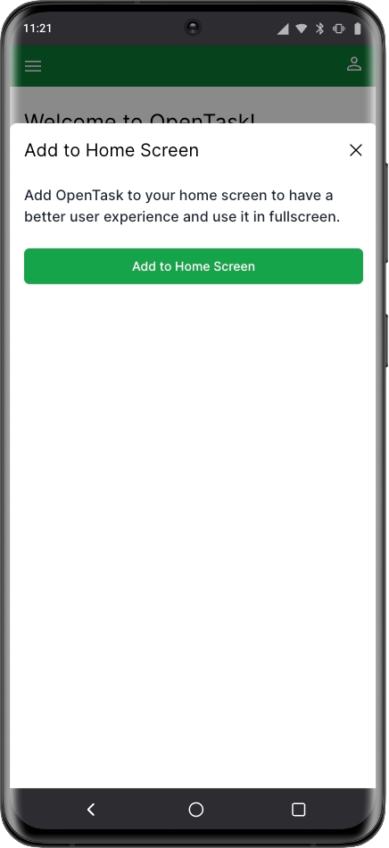
    </ImageWithCaption>
  </div>
</div>

Since [_`BeforeInstallPromptEvent.prompt()`_](https://developer.mozilla.org/en-US/docs/Web/API/BeforeInstallPromptEvent/prompt) is unavailable on iOS, we instruct iOS users to add it to the home screen.

<div style={{ width: '100%', flexDirection: 'row', justifyContent: 'center' }}>
  <div style={{ maxWidth: '280px', flexGrow: 1 }}>
    <ImageWithCaption caption="Install PWA on iPhone">
      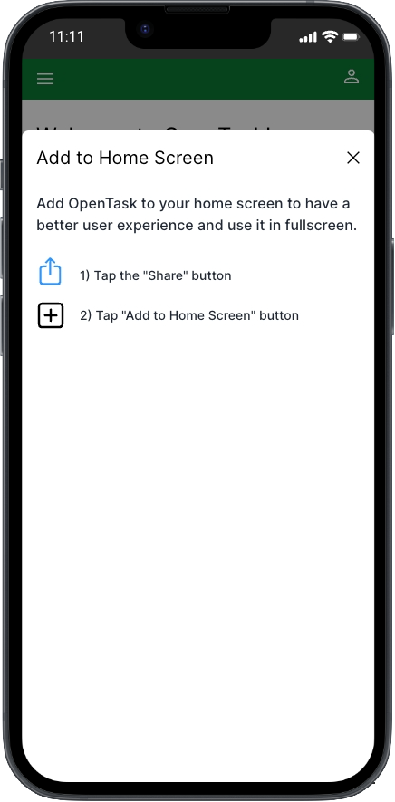
    </ImageWithCaption>
  </div>
</div>

We use [localStorage](https://developer.mozilla.org/en-US/docs/Web/API/Window/localStorage) to prevent showing this dialog more than once for the same device.

#### \<MainMenu\>

File: [_`src/features/app/shared/ui/MainMenu.tsx`_](https://github.com/flsilva/opentask/blob/feb-2024/src/features/app/shared/ui/MainMenu.tsx)

[_`<MainMenu>`_](https://github.com/flsilva/opentask/blob/feb-2024/src/features/app/shared/ui/MainMenu.tsx) is a Server Component that renders a [_`<ProjectList>`_](https://github.com/flsilva/opentask/blob/feb-2024/src/features/app/projects/ui/ProjectList.tsx) Server Component alongside a couple other buttons.

Here's a simplified version of it:

```tsx MainMenu.tsx
import { Suspense } from 'react';
import { ProjectList } from '@/features/app/projects/ui/ProjectList';
import { ProjectListSkeleton } from '@/features/app/projects/ui/ProjectListSkeleton';

export const MainMenu = ({
  className
}: ClassNamePropsOptional) => {
  return (
    ...
    <Suspense fallback={<ProjectListSkeleton />}>
      <ProjectList only="active" />
    </Suspense>
    ...
  );
}
```

We'll look into [_`<ProjectList>`_](https://github.com/flsilva/opentask/blob/feb-2024/src/features/app/projects/ui/ProjectList.tsx) moving forward.

#### \<MainMenuDialogPage\>

<div style={{ width: '100%', flexDirection: 'row', justifyContent: 'center' }}>
  <div style={{ maxWidth: '280px', flexGrow: 1 }}>
    <ImageWithCaption caption="Main Menu Dialog Page on iPhone">
      
    </ImageWithCaption>
  </div>
</div>

File: [_`src/app/app/@dialog/(.)main-menu/page.tsx`_](<https://github.com/flsilva/opentask/blob/feb-2024/src/app/app/%40dialog/(.)main-menu/page.tsx>)

The _`/app/main-menu`_ route is only accessible on small screens. It leverages Next's Intercepting Routes feature to render the [_`<MainMenuDialogPage>`_](<https://github.com/flsilva/opentask/blob/feb-2024/src/app/app/%40dialog/(.)main-menu/page.tsx>) Server Component in a [_`<Dialog>`_](https://github.com/flsilva/opentask/blob/feb-2024/src/features/shared/ui/dialog/Dialog.tsx).

Here's the entire code for it:

```tsx page.tsx
import { Dialog } from '@/features/shared/ui/dialog/Dialog';
import { MainMenu } from '@/features/app/shared/ui/MainMenu';
import { RouterActions } from '@/features/shared/routing/RouterActions';

export default function MainMenuDialogPage() {
  return (
    <Dialog>
      <MainMenu />
    </Dialog>
  );
}
```

When we're at _`/app/main-menu`_ route and refresh the browser, the _regular_ route component is rendered instead of the Intercepting Route one. That regular route component is [_`<MainMenuPage>`_](https://github.com/flsilva/opentask/blob/feb-2024/src/app/app/main-menu/page.tsx), located at [_`src/app/app/main-menu/page.tsx`_](https://github.com/flsilva/opentask/blob/feb-2024/src/app/app/main-menu/page.tsx).

<div style={{ width: '100%', flexDirection: 'row', justifyContent: 'center' }}>
  <div style={{ maxWidth: '280px', flexGrow: 1 }}>
    <ImageWithCaption caption="Main Menu Page on iPhone">
      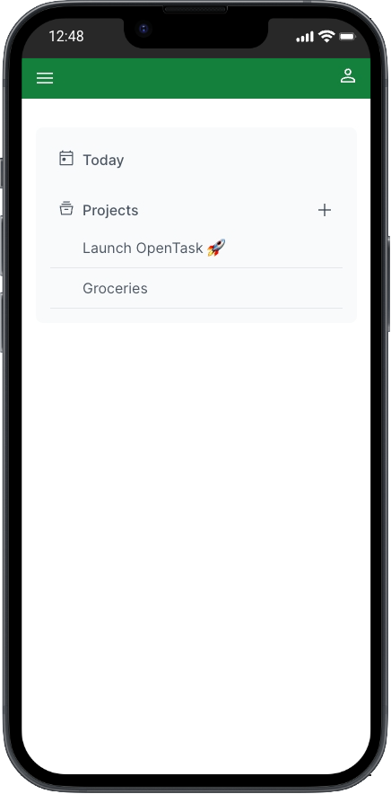
    </ImageWithCaption>
  </div>
</div>

Here's the entire code for it:

```tsx page.tsx
import { MainMenu } from '@/features/app/shared/ui/MainMenu';

export default function MainMenuPage() {
  return <MainMenu className="mt-8" />;
}
```

Notice we don't wrap [_`<MainMenu>`_](https://github.com/flsilva/opentask/blob/feb-2024/src/features/app/shared/ui/MainMenu.tsx) in a [_`<Dialog>`_](https://github.com/flsilva/opentask/blob/feb-2024/src/features/shared/ui/dialog/Dialog.tsx) here.

#### Onboarding page

<br />
<br />

<div style={{ width: '100%', flexDirection: 'row', justifyContent: 'center' }}>
  <div style={{ maxWidth: '280px', flexGrow: 1 }}>
    <ImageWithCaption caption="Onboarding Page on iPhone">
      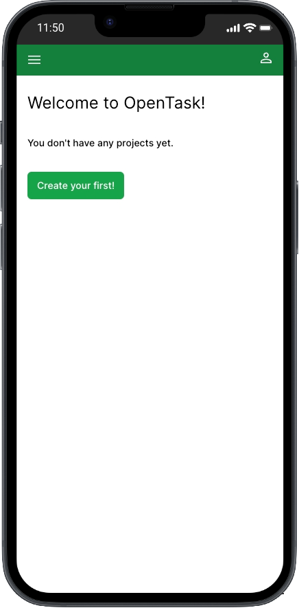
    </ImageWithCaption>
  </div>
</div>

<div style={{ width: '100%', flexDirection: 'row', justifyContent: 'center' }}>
  <div style={{ maxWidth: '720px', flexGrow: 1 }}>
    <ImageWithCaption caption="Onboarding Page on iPad">
      
    </ImageWithCaption>
  </div>
</div>

File: [_`src/app/app/onboarding/page.tsx`_](https://github.com/flsilva/opentask/blob/feb-2024/src/app/app/onboarding/page.tsx)

[_`<OnboardingPage>`_](https://github.com/flsilva/opentask/blob/feb-2024/src/app/app/onboarding/page.tsx) is a pretty straightforward Server Component. It fetches all user's projects and either renders itself to ask the user to create a first project or redirects them to the [_`<TodayPage>`_](https://github.com/flsilva/opentask/blob/feb-2024/src/app/app/today/page.tsx) if they already have projects.

Here's the entire code for it:

```tsx page.tsx
import Link from 'next/link';
import { redirect } from 'next/navigation';
import { twMerge } from 'tailwind-merge';
import { buttonGreenClassName } from '@/features/shared/ui/control/button/buttonClassName';
import { ErrorList } from '@/features/shared/ui/error/ErrorList';
import { getProjects } from '@/features/app/projects/data-access/ProjectsDataAccess';

export default async function OnboardingPage() {
  const { data: projects, errors } = await getProjects();
  if (errors) return <ErrorList errors={errors} />;
  if (projects && projects.length > 0) redirect('/app/today');

  return (
    <>
      <h2 className="mt-6 text-2xl">Welcome to OpenTask!</h2>
      <p className="mt-8 text-sm font-medium">You don&#39;t have any projects yet.</p>
      <Link href="/app/projects/new" className={twMerge(buttonGreenClassName, 'w-fit mt-8')}>
        Create your first!
      </Link>
    </>
  );
}
```

#### Project pages and components

Routing module: [_`src/app/app/projects`_](https://github.com/flsilva/opentask/tree/feb-2024/src/app/app/projects)<br />
Feature module: [_`src/features/app/projects`_](https://github.com/flsilva/opentask/tree/feb-2024/src/features/app/projects)

Let's now move to the implementation of the project pages.

#### \<NewProjectDialogPage\> and \<NewProjecPage\>

[_`<TodayPage>`_](https://github.com/flsilva/opentask/blob/feb-2024/src/app/app/today/page.tsx) renders tasks, and tasks depend on pre-existing projects to be created. Therefore, let's first look into how project and task pages are implemented before finishing with an explanation of how the [_`<TodayPage>`_](https://github.com/flsilva/opentask/blob/feb-2024/src/app/app/today/page.tsx) page is created. That will bring our series of explanations to a close.

When we click the _`+`_ icon button next to the _`Projects`_ button in [_`<MainMenu>`_](https://github.com/flsilva/opentask/blob/feb-2024/src/features/app/shared/ui/MainMenu.tsx), we soft navigate to _`/app/projects/new`_. Since we set up an Intercepting Route for it, [_`<NewProjectDialogPage>`_](<https://github.com/flsilva/opentask/blob/feb-2024/src/app/app/%40dialog/(.)projects/new/page.tsx>) gets rendered, which is located at [_`src/app/app/@dialog/(.)projects/new/page.tsx`_](<https://github.com/flsilva/opentask/blob/feb-2024/src/app/app/%40dialog/(.)projects/new/page.tsx>):

<div style={{ width: '100%', flexDirection: 'row', justifyContent: 'center' }}>
  <div style={{ maxWidth: '280px', flexGrow: 1 }}>
    <ImageWithCaption caption="New Project Dialog Page on iPhone">
      
    </ImageWithCaption>
  </div>
</div>

<div style={{ width: '100%', flexDirection: 'row', justifyContent: 'center' }}>
  <div style={{ maxWidth: '720px', flexGrow: 1 }}>
    <ImageWithCaption caption="New Project Dialog Page on iPad">
      
    </ImageWithCaption>
  </div>
</div>

The [_`<NewProjectDialogPage>`_](<https://github.com/flsilva/opentask/blob/feb-2024/src/app/app/%40dialog/(.)projects/new/page.tsx>) is an excellent example of how this new [hybrid web application model](/blog/react-server-components-and-a-new-hybrid-web-app-model/#a-new-hybrid-web-application-model) works, depicting a lovely hybrid React component tree.

Here's the entire code for it:

```tsx page.tsx
import { RouterActions } from '@/features/shared/routing/RouterActions';
import { Dialog } from '@/features/shared/ui/dialog/Dialog';
import { ProjectForm } from '@/features/app/projects/ui/ProjectForm';

export default function NewProjectDialogPage() {
  return (
    <Dialog defaultOpen title="Create project" routerActionOnClose={RouterActions.Back}>
      <ProjectForm className="mt-6" />
    </Dialog>
  );
}
```

[_`<Dialog>`_](https://github.com/flsilva/opentask/blob/feb-2024/src/features/shared/ui/dialog/Dialog.tsx) is a Client Component wrapping Radix's [Dialog component](https://www.radix-ui.com/primitives/docs/components/dialog), which handles client (browser) APIs such as the _`esc`_ key press to close itself.

[_`<ProjectForm>`_](https://github.com/flsilva/opentask/blob/feb-2024/src/features/app/projects/ui/ProjectForm.tsx) is a Server Component that's also reused in [_`<EditProjectDialogPage>`_](<https://github.com/flsilva/opentask/blob/feb-2024/src/app/app/%40dialog/(.)projects/%5BprojectId%5D/edit/page.tsx>), as we'll see next. When editing projects, we pass a project ID like _`<ProjectForm projectId="ID_HERE">`_, and it fetches the project and fills in the form fields.

It turns out that that hybrid component tree is also a great example of how to [interleave Client and Server Components](/blog/react-server-components-and-a-new-hybrid-web-app-model/#interleaving-server-and-client-components): a Client Component, [_`<Dialog>`_](https://github.com/flsilva/opentask/blob/feb-2024/src/features/shared/ui/dialog/Dialog.tsx), receives and renders a Server Component, [_`<ProjectForm>`_](https://github.com/flsilva/opentask/blob/feb-2024/src/features/app/projects/ui/ProjectForm.tsx), as _`children`_.

But Intercepting Routes only render when we soft navigate to them. If we refresh the browser while at _`/app/projects/new`_, or share that link with someone who opens it, the _regular_ route component is rendered instead of the Intercepting Route one. That regular route component is [_`<NewProjectPage>`_](https://github.com/flsilva/opentask/blob/feb-2024/src/app/app/projects/new/page.tsx), located at [_`src/app/app/projects/new/page.tsx`_](https://github.com/flsilva/opentask/blob/feb-2024/src/app/app/projects/new/page.tsx).

For those use cases, we don't have a previously rendered page to render a dialog over, so we don't render a dialog at all. We render it as a self-contained page:

<div style={{ width: '100%', flexDirection: 'row', justifyContent: 'center' }}>
  <div style={{ maxWidth: '280px', flexGrow: 1 }}>
    <ImageWithCaption caption="New Project Page on iPhone">
      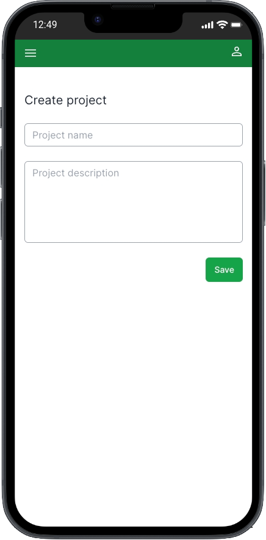
    </ImageWithCaption>
  </div>
</div>

<div style={{ width: '100%', flexDirection: 'row', justifyContent: 'center' }}>
  <div style={{ maxWidth: '720px', flexGrow: 1 }}>
    <ImageWithCaption caption="New Project Page on iPad">
      
    </ImageWithCaption>
  </div>
</div>

Here's the entire code for it:

```tsx page.tsx
import { ProjectForm } from '@/features/app/projects/ui/ProjectForm';

export default function NewProjectPage() {
  return (
    <div className="flex flex-col mt-10">
      <h1 className="text-xl text-gray-800">Create project</h1>
      <ProjectForm className="mt-6" />
    </div>
  );
}
```

It works just like the dialog version, though. Nice and easy, huh?

<InfoBox>
You can go ahead and create a project now.

What? You haven't signed up? You're kidding, right? 😅

Please go ahead and sign up now and create your first project to follow these explanations more closely. You can delete your account at any time on the _`Settings`_ page, and all your data will be immediately and permanently deleted. No soft deletes and no backups. OpenTask is an engineering case, not an actual product.

And if you see any bugs while you're testing it, please [create an issue](https://github.com/flsilva/opentask/issues). If you have any thoughts, please share them [in the discussions](https://github.com/flsilva/opentask/discussions) or in the [comments below](#post-comments).

Let's make it a nice community project to experiment and discover new React and Next.js patterns and solutions to real-world problems while we improve ourselves and help others.

</InfoBox>

Before moving to [_`<ProjectForm>`_](https://github.com/flsilva/opentask/blob/feb-2024/src/features/app/projects/ui/ProjectForm.tsx), let's look into [_`<EditProjectDialogPage>`_](<https://github.com/flsilva/opentask/blob/feb-2024/src/app/app/%40dialog/(.)projects/%5BprojectId%5D/edit/page.tsx>) and [_`<EditProjectPage>`_](https://github.com/flsilva/opentask/blob/feb-2024/src/app/app/projects/%5BprojectId%5D/edit/page.tsx).

#### \<EditProjectDialogPage\> and \<EditProjectPage\>

After we create a project, we're redirected to the project page at _`/app/projects/[projectId]`_, which renders [_`<ProjectPage>`_](https://github.com/flsilva/opentask/blob/feb-2024/src/app/app/projects/%5BprojectId%5D/page.tsx) (details to follow). There, you can see the three-dot button. Clicking it pops up a menu:

<div style={{ width: '100%', flexDirection: 'row', justifyContent: 'center' }}>
  <div style={{ maxWidth: '280px', flexGrow: 1 }}>
    <ImageWithCaption caption="Project Page Menu on iPhone">
      
    </ImageWithCaption>
  </div>
</div>

Clicking _`Edit project`_ opens the [_`<EditProjectDialogPage>`_](<https://github.com/flsilva/opentask/blob/feb-2024/src/app/app/%40dialog/(.)projects/%5BprojectId%5D/edit/page.tsx>):

<div style={{ width: '100%', flexDirection: 'row', justifyContent: 'center' }}>
  <div style={{ maxWidth: '280px', flexGrow: 1 }}>
    <ImageWithCaption caption="Edit Project Dialog Page on iPhone">
      
    </ImageWithCaption>
  </div>
</div>

<div style={{ width: '100%', flexDirection: 'row', justifyContent: 'center' }}>
  <div style={{ maxWidth: '720px', flexGrow: 1 }}>
    <ImageWithCaption caption="Edit Project Dialog Page on iPad">
      
    </ImageWithCaption>
  </div>
</div>

Because [_`<ProjectForm>`_](https://github.com/flsilva/opentask/blob/feb-2024/src/features/app/projects/ui/ProjectForm.tsx) does the hard work (data fetching), all we have to do is render it passing a _`projectId`_.

Here's the entire code for [_`<EditProjectDialogPage>`_](<https://github.com/flsilva/opentask/blob/feb-2024/src/app/app/%40dialog/(.)projects/%5BprojectId%5D/edit/page.tsx>), located at [_`src/app/app/@dialog/(.)projects/[projectId]/edit/page.tsx`_](<https://github.com/flsilva/opentask/blob/feb-2024/src/app/app/%40dialog/(.)projects/%5BprojectId%5D/edit/page.tsx>):

```tsx page.tsx
import { Suspense } from 'react';
import { Dialog } from '@/features/shared/ui/dialog/Dialog';
import { RouterActions } from '@/features/shared/routing/RouterActions';
import { ProjectForm } from '@/features/app/projects/ui/ProjectForm';
import { ProjectFormSkeleton } from '@/features/app/projects/ui/ProjectFormSkeleton';

interface EditProjectDialogPageProps {
  readonly params: { readonly projectId: string };
}

export default function EditProjectDialogPage({
  params: { projectId },
}: EditProjectDialogPageProps) {
  return (
    <Dialog defaultOpen title="Edit project" routerActionOnClose={RouterActions.Back}>
      <Suspense fallback={<ProjectFormSkeleton className="mt-6" ssrOnly="Loading project..." />}>
        <ProjectForm className="mt-6" projectId={projectId} />
      </Suspense>
    </Dialog>
  );
}
```

We wrap [_`<ProjectForm>`_](https://github.com/flsilva/opentask/blob/feb-2024/src/features/app/projects/ui/ProjectForm.tsx) in [_`<Suspense>`_](https://react.dev/reference/react/Suspense) to render a [_`<Dialog>`_](https://github.com/flsilva/opentask/blob/feb-2024/src/features/shared/ui/dialog/Dialog.tsx) with a title and a [_`<ProjectFormSkeleton>`_](https://github.com/flsilva/opentask/blob/feb-2024/src/features/app/projects/ui/ProjectFormSkeleton.tsx) right away, while [_`<ProjectForm>`_](https://github.com/flsilva/opentask/blob/feb-2024/src/features/app/projects/ui/ProjectForm.tsx) fetches the project data. When data is loaded, [_`<ProjectForm>`_](https://github.com/flsilva/opentask/blob/feb-2024/src/features/app/projects/ui/ProjectForm.tsx) is rendered on the server and streamed to the browser. That's [streaming server rendering](https://www.patterns.dev/react/streaming-ssr/).

I love the easy implementation of such advanced features, resulting in a great user experience while controlling their look and where to put them.

If we refresh the page, we also render a _regular_ route component, not the Intercepting Route one. That route component is [_`<EditProjectPage>`_](https://github.com/flsilva/opentask/blob/feb-2024/src/app/app/projects/%5BprojectId%5D/edit/page.tsx), located at [_`src/app/app/projects/[projectId]/edit/page.tsx`_](https://github.com/flsilva/opentask/blob/feb-2024/src/app/app/projects/%5BprojectId%5D/edit/page.tsx).

<div style={{ width: '100%', flexDirection: 'row', justifyContent: 'center' }}>
  <div style={{ maxWidth: '280px', flexGrow: 1 }}>
    <ImageWithCaption caption="Edit Project Page on iPhone">
      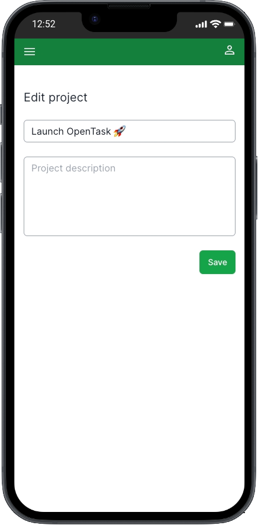
    </ImageWithCaption>
  </div>
</div>

<div style={{ width: '100%', flexDirection: 'row', justifyContent: 'center' }}>
  <div style={{ maxWidth: '720px', flexGrow: 1 }}>
    <ImageWithCaption caption="Edit Project Page on iPad">
      
    </ImageWithCaption>
  </div>
</div>

Here's the entire code for it:

```tsx page.tsx
import { Suspense } from 'react';
import { ProjectForm } from '@/features/app/projects/ui/ProjectForm';
import { ProjectFormSkeleton } from '@/features/app/projects/ui/ProjectFormSkeleton';

interface EditProjectPageProps {
  readonly params: { readonly projectId: string };
}

export default function EditProjectPage({ params: { projectId } }: EditProjectPageProps) {
  return (
    <div className="flex flex-col mt-10">
      <h1 className="text-xl text-gray-800">Edit project</h1>
      <Suspense fallback={<ProjectFormSkeleton className="mt-6" ssrOnly="Loading project..." />}>
        <ProjectForm className="mt-6" projectId={projectId} />
      </Suspense>
    </div>
  );
}
```

Could it be simpler? Well, I like it a lot!

We also wrap [_`<ProjectForm>`_](https://github.com/flsilva/opentask/blob/feb-2024/src/features/app/projects/ui/ProjectForm.tsx) in [_`<Suspense>`_](https://react.dev/reference/react/Suspense) to render a title and skeleton immediately while waiting for the project data to be loaded and presented to the user.

Now, let's see how [_`<ProjectForm>`_](https://github.com/flsilva/opentask/blob/feb-2024/src/features/app/projects/ui/ProjectForm.tsx) is implemented.

#### \<ProjectForm\>

File: [_`src/features/app/projects/ui/ProjectForm.tsx`_](https://github.com/flsilva/opentask/blob/feb-2024/src/features/app/projects/ui/ProjectForm.tsx)

[_`<ProjectForm>`_](https://github.com/flsilva/opentask/blob/feb-2024/src/features/app/projects/ui/ProjectForm.tsx) was the first form component I built with the new App Router and React 18 canary features like _`<form action={}>`_, [_`useFormStatus()`_](https://react.dev/reference/react-dom/hooks/useFormStatus), and [_`useFormState()`_](https://react.dev/reference/react-dom/hooks/useFormState).

I wanted to figure out the best new way to build forms in React, and I wanted it to be as simple as possible and a Server Component because of its many benefits. I didn't get it right initially; it was a Client Component, but I managed to refactor it later to get to the present Server Component version.

Here's the entire code for it:

```tsx ProjectForm.tsx
'use server';

import 'server-only';
import { notFound } from 'next/navigation';
import { twMerge } from 'tailwind-merge';
import { ClassNamePropsOptional } from '@/features/shared/ui/ClassNameProps';
import { buttonGreenClassName } from '@/features/shared/ui/control/button/buttonClassName';
import { SubmitButton } from '@/features/shared/ui/control/button/SubmitButton';
import { inputTextClassName } from '@/features/shared/ui/control/input/inputTextClassName';
import { ServerError } from '@/features/shared/data-access/ServerResponse';
import { ErrorList } from '@/features/shared/ui/error/ErrorList';
import { Form } from '@/features/shared/ui/form/Form';
import { FormErrorList } from '@/features/shared/ui/form/FormErrorList';
import {
  ProjectDto,
  createProject,
  getProjectById,
  updateProject,
} from '../data-access/ProjectsDataAccess';

export interface ProjectFormProps extends ClassNamePropsOptional {
  readonly projectId?: string;
}

export const ProjectForm = async ({ className, projectId }: ProjectFormProps) => {
  let project: ProjectDto | undefined | null;
  let errors: Array<ServerError> | undefined;

  if (projectId) ({ data: project, errors } = await getProjectById(projectId));
  if (errors) return <ErrorList errors={errors} />;
  if (projectId && !project) notFound();

  const name = (project && project.name) ?? '';
  const description = (project && project.description) ?? '';
  const formAction = project ? updateProject : createProject;

  return (
    <Form action={formAction}>
      {project && <input type="hidden" name="id" value={project.id} />}
      <input
        autoFocus
        defaultValue={name}
        name="name"
        type="text"
        placeholder="Project name"
        className={twMerge(inputTextClassName, 'mb-6')}
        required
        minLength={1}
        maxLength={500}
        autoComplete="off"
      />
      <textarea
        defaultValue={description}
        name="description"
        placeholder="Project description"
        rows={5}
        maxLength={500}
        className={twMerge(inputTextClassName, 'mb-6 resize-none')}
      ></textarea>
      <FormErrorList />
      <SubmitButton className={twMerge(buttonGreenClassName, 'flex self-end')}>Save</SubmitButton>
    </Form>
  );
};
```

I've been building React apps (and forms!) since 2016, and I like that a lot. It's clean and easy to follow.

First and foremost, let's remember that this form component supports creating and editing projects besides fetching the project data to be edited.

That allows us to throw it in any component tree, passing a _`projectId`_ to it. We don't have to worry about its data dependencies, i.e., how it fetches and persists data.

<InfoBox>
I'm calling this kind of component a [full-stack component](/blog/react-server-components-and-a-new-hybrid-web-app-model/#building-full-stack-react-components): a self-contained data-driven Server Component that's fully reusable and composable despite its data dependencies.

That has never been possible before and is now possible thanks to React Server Components.

</InfoBox>

The lack of a state management is noteworthy. It is, after all, a Server Component, and [Server Components are stateless and non-interactive](/blog/react-server-components-and-a-new-hybrid-web-app-model/#what-are-react-server-components-rscs). It has to be a Server Component to fetch project data we want to edit.

Once you understand Server Components, you appreciate how it simplifies the code, reducing complexity and the cognitive load to understand your components.

We can easily follow the code from top to bottom because even though it fetches data asynchronously, we don't have to worry about the component lifecycle.

<InfoBox>
Server Components don't have any lifecycle. The logic flows from top to bottom and ends there.

That's why [we don't use hooks in Server Components](/blog/react-server-components-and-a-new-hybrid-web-app-model/#hooks), we don't need them.

**Hooks don't apply to Server Components.**

</InfoBox>

The following line of code assigns the correct Server Action used in _`<form action={}>`_:

```tsx
const formAction = project ? updateProject : createProject;
```

When we're editing a project, the following line of code renders a _`hidden`_ input field with the _`project.id`_:

```tsx
{
  project && <input type="hidden" name="id" value={project.id} />;
}
```

I like returning to this old HTML standard. We don't have to build JavaScript objects to send data to the server; that's handled automatically.

I also like the App Router convention of having a separate _`not-found.tsx`_ page component that we can easily render in place of the current page:

```tsx
if (projectId && !project) notFound();
```

This component is located at [_`src/app/app/projects/not-found.tsx`_](https://github.com/flsilva/opentask/blob/feb-2024/src/app/app/projects/not-found.tsx).

We could refactor how to display errors when fetching project data to leverage the same convention, this time throwing a JavaScript error to render an _`error.tsx`_ instead of manually rendering the errors as I'm doing here:

```tsx
if (errors) return <ErrorList errors={errors} />;
```

That's something I want to check out eventually. It's not a big deal, but I want to keep the codebase aligned with the App Router conventions.

Even though [_`<ProjectForm>`_](https://github.com/flsilva/opentask/blob/feb-2024/src/features/app/projects/ui/ProjectForm.tsx) is a Server Component, [_`<Form>`_](https://github.com/flsilva/opentask/blob/feb-2024/src/features/shared/ui/form/Form.tsx), [_`<FormErrorList>`_](https://github.com/flsilva/opentask/blob/feb-2024/src/features/shared/ui/form/FormErrorList.tsx), and [_`<SubmitButton>`_](https://github.com/flsilva/opentask/blob/feb-2024/src/features/shared/ui/control/button/SubmitButton.tsx) are Client Components.

Let's take a look at each one of them.

##### \<Form\>

[_`<Form>`_](https://github.com/flsilva/opentask/blob/feb-2024/src/features/shared/ui/form/Form.tsx) is a reusable component I built to provide a few utility features around form functionality, besides rendering _`<form action={}>`_.

For [_`<ProjectForm>`_](https://github.com/flsilva/opentask/blob/feb-2024/src/features/app/projects/ui/ProjectForm.tsx), we only use a single custom feature of it, which is the only reason we use it instead of a plain _`<form action={}>`_.

That feature is the creation of a context to provide the response object from the server (see below).

##### \<FormErrorList\>

That response object is used by [_`<FormErrorList>`_](https://github.com/flsilva/opentask/blob/feb-2024/src/features/shared/ui/form/FormErrorList.tsx) to check for errors coming from the server.

Here's the entire code for it:

```tsx FormErrorList.tsx
'use client';

import 'client-only';
import { useContext } from 'react';
import { ErrorList } from '@/features/shared/ui/error/ErrorList';
import { FormContext } from './Form';

export const FormErrorList = () => {
  const { response } = useContext(FormContext);
  if (!response || !response.errors) return null;

  return <ErrorList errors={response.errors} />;
};
```

[_`<ErrorList>`_](https://github.com/flsilva/opentask/blob/feb-2024/src/features/shared/ui/error/ErrorList.tsx) just renders a list of errors.

##### \<SubmitButton\>

The [_`<SubmitButton>`_](https://github.com/flsilva/opentask/blob/feb-2024/src/features/shared/ui/control/button/SubmitButton.tsx) Client Component renders a _`<button type="submit">`_ and [_`useFormStatus()`_](https://react.dev/reference/react-dom/hooks/useFormStatus) to render a spinner loading when _`pending === true`_.

##### Data validation

We must always validate data in the server before persisting it to the database.

But it's generally a good practice to validate data on the client side, too, for faster feedback and an improved UX instead of allowing the user to submit invalid data and wait for the server to respond with errors.

[_`<ProjectForm>`_](https://github.com/flsilva/opentask/blob/feb-2024/src/features/app/projects/ui/ProjectForm.tsx) has only two input fields, _`name`_ and _`description`_, and only _`name`_ is madatory.

We use standard HTML form validation here, but we could reuse the same [zod](https://zod.dev/) validation method we use in the server and display error messages below the input field for an improved UX. That's a good enhancement for the future.

We can easily spot other features from the code, like using the standard HTML _`autofocus`_ attribute.

##### Improved experience building forms

Overall, we have a much-improved experience building forms in React without any third-party library.

The new React APIs, including [_`<form action={}>`_](https://react.dev/reference/react-dom/components/form#handle-form-submission-with-a-server-action), [_`useFormStatus()`_](https://react.dev/reference/react-dom/hooks/useFormStatus), and [_`useFormState()`_](https://react.dev/reference/react-dom/hooks/useFormState), make it less complex to build forms with basic features. There is always room for improvement, but React is getting better at tackling this problem.

##### Thrid-party form libraries

Even though I'm not using a third-party form library in OpenTask, I'm sure plenty of advanced use cases still exist to use great libraries like [React Hook Form](https://react-hook-form.com/).

When an external library makes it substantially simpler, we should use it.

#### createProject()

When creating new projects, we submit the form data to the [_`createProject()`_](https://github.com/flsilva/opentask/blob/feb-2024/src/features/app/projects/data-access/ProjectsDataAccess.ts#L27) Server Action.

It validates [_`FormData`_](https://developer.mozilla.org/en-US/docs/Web/API/FormData) with [zod](https://zod.dev/), gets the authenticated user ID from the current session, generates a new project ID with [_`cuid2()`_](https://github.com/paralleldrive/cuid2), and calls _`prisma.project.create()`_.

If there's an error validating data with zod, we return those errors to display in the UI.

If there's an error unrelated to data validation, we return a generic, friendly error message to the user instead of the unknown one. We should log that unknown error to a logging/monitoring service. That's currently pending in OpenTask and is another good future enhancement.

If there are no errors, we redirect the user to the recently created project page.

Here's the entire code for [_`createProject()`_](https://github.com/flsilva/opentask/blob/feb-2024/src/features/app/projects/data-access/ProjectsDataAccess.ts#L27), extracted from [_`src/features/app/projects/data-access/ProjectsDataAccess.ts`_](https://github.com/flsilva/opentask/blob/feb-2024/src/features/app/projects/data-access/ProjectsDataAccess.ts):

```ts ProjectsDataAccess.ts
'use server';

import 'server-only';
import { redirect } from 'next/navigation';
import { z } from 'zod';
import { cuid2 } from '@/features/shared/data-access/cuid2';
import { prisma } from '@/features/shared/data-access/prisma';
import {
  ServerResponse,
  createServerErrorResponse,
  createServerSuccessResponse,
} from '@/features//shared/data-access/ServerResponse';
import { genericAwareOfInternalErrorMessage } from '@/features/shared/ui/error/errorMessages';
import { getServerSideUser } from '@/features/app/users/data-access/UsersDataAccess';
import {
  createProjectSchema,
  deleteProjectSchema,
  updateProjectSchema,
} from '../domain/ProjectsDomain';

export type CreateProjectDto = z.infer<typeof createProjectSchema>;

export type UpdateProjectDto = z.infer<typeof updateProjectSchema>;

export type ProjectDto = CreateProjectDto & { id: string };

export const createProject = async (
  prevResponse: ServerResponse<ProjectDto> | undefined,
  formData: FormData,
) => {
  const validation = createProjectSchema.safeParse(Object.fromEntries(formData));

  if (!validation.success) {
    console.error(validation.error);

    // return Zod validation errors.
    return createServerErrorResponse<ProjectDto>(validation.error);
  }

  let result;

  try {
    const { data } = validation;
    const { id } = await getServerSideUser();

    result = await prisma.project.create({
      data: {
        author: {
          connect: {
            id,
          },
        },
        ...data,
        id: cuid2(),
      },
    });
  } catch (error) {
    console.error(error);

    // return a friendly error message instead of the unknown real one.
    return createServerErrorResponse<ProjectDto>(genericAwareOfInternalErrorMessage);
  }

  redirect(`/app/projects/${result.id}`);
};
```

We don't return the _`result`_ data from this Server Action because we redirect the user to a different route, unmounting the component calling [_`createProject()`_](https://github.com/flsilva/opentask/blob/feb-2024/src/features/app/projects/data-access/ProjectsDataAccess.ts#L27).

The [_`updateProject()`_](https://github.com/flsilva/opentask/blob/feb-2024/src/features/app/projects/data-access/ProjectsDataAccess.ts#L131) Server Action is very similar.

#### \<ActiveProjectsPage\> and \<ArchivedProjectsPage\>

File: [_`src/app/app/projects/active/page.tsx`_](https://github.com/flsilva/opentask/blob/feb-2024/src/app/app/projects/active/page.tsx)

File: [_`src/app/app/projects/archived/page.tsx`_](https://github.com/flsilva/opentask/blob/feb-2024/src/app/app/projects/archived/page.tsx)

Clicking the _`Projects`_ button in _`<MainMenu>`_ navigates to _`/app/projects/active`_, rendering the [_`<ActiveProjectsPage>`_](https://github.com/flsilva/opentask/blob/feb-2024/src/app/app/projects/active/page.tsx) route component:

<div style={{ width: '100%', flexDirection: 'row', justifyContent: 'center' }}>
  <div style={{ maxWidth: '280px', flexGrow: 1 }}>
    <ImageWithCaption caption="Active Projects Page on iPhone">
      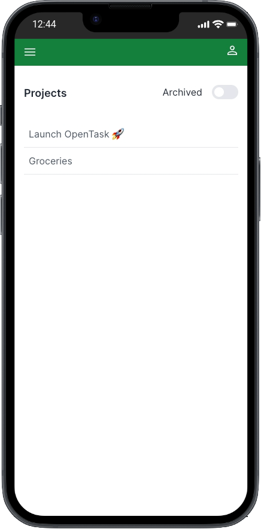
    </ImageWithCaption>
  </div>
</div>

<div style={{ width: '100%', flexDirection: 'row', justifyContent: 'center' }}>
  <div style={{ maxWidth: '720px', flexGrow: 1 }}>
    <ImageWithCaption caption="Active Projects Page on iPad">
      
    </ImageWithCaption>
  </div>
</div>

Here's the entire code for it:

```tsx page.tsx
import { Suspense } from 'react';
import { ProjectList } from '@/features/app/projects/ui/ProjectList';
import { ProjectListSkeleton } from '@/features/app/projects/ui/ProjectListSkeleton';
import { ProjectsPageHeader } from '@/features/app/projects/ui/ProjectsPageHeader';

export default function ActiveProjectsPage() {
  const empty = <p className="text-sm font-medium text-gray-600">No active projects.</p>;

  return (
    <>
      <ProjectsPageHeader archived={false} />
      <Suspense fallback={<ProjectListSkeleton ssrOnly="Loading projects..." />}>
        <ProjectList empty={empty} itemClassName="pl-2" only="active" />
      </Suspense>
    </>
  );
}
```

We can use the switch component to navigate between active (_`/app/projects/active`_) and archived projects (_`/app/projects/archived`_).

Here's the [_`<ArchivedProjectsPage>`_](https://github.com/flsilva/opentask/blob/feb-2024/src/app/app/projects/archived/page.tsx):

<div style={{ width: '100%', flexDirection: 'row', justifyContent: 'center' }}>
  <div style={{ maxWidth: '280px', flexGrow: 1 }}>
    <ImageWithCaption caption="Archived Projects Page on iPhone">
      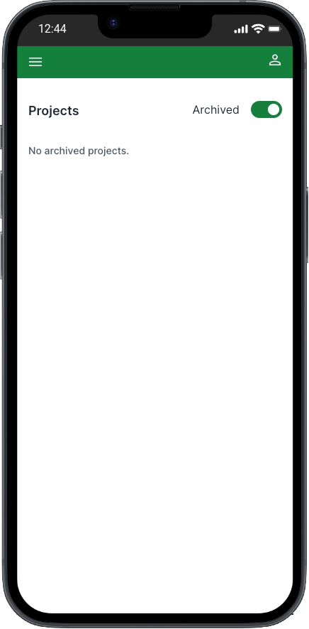
    </ImageWithCaption>
  </div>
</div>

<div style={{ width: '100%', flexDirection: 'row', justifyContent: 'center' }}>
  <div style={{ maxWidth: '720px', flexGrow: 1 }}>
    <ImageWithCaption caption="Archived Projects Page on iPad">
      
    </ImageWithCaption>
  </div>
</div>

And here's the entire code for it:

```tsx page.tsx
import { Suspense } from 'react';
import { ProjectList } from '@/features/app/projects/ui/ProjectList';
import { ProjectListSkeleton } from '@/features/app/projects/ui/ProjectListSkeleton';
import { ProjectsPageHeader } from '@/features/app/projects/ui/ProjectsPageHeader';

export default function ArchivedProjectsPage() {
  const empty = <p className="text-sm font-medium text-gray-600">No archived projects.</p>;

  return (
    <>
      <ProjectsPageHeader archived={true} />
      <Suspense fallback={<ProjectListSkeleton ssrOnly="Loading projects..." />}>
        <ProjectList empty={empty} itemClassName="pl-2" only="archived" />
      </Suspense>
    </>
  );
}
```

It's exactly the same as _`<ActiveProjectsPage>`_ except for three things: slightly different _`empty`_ message, passes _`archived={true}`_ to [_`<ProjectsPageHeader>`_](https://github.com/flsilva/opentask/blob/feb-2024/src/features/app/projects/ui/ProjectsPageHeader.tsx) (the component rendering [_`<Switch>`_](https://github.com/flsilva/opentask/blob/feb-2024/src/features/shared/ui/control/switch/Switch.tsx)) instead of _`archived={false}`_, and passes _`only="archived"`_ to [_`<ProjectList>`_](https://github.com/flsilva/opentask/blob/feb-2024/src/features/app/projects/ui/ProjectList.tsx) instead of _`only="active"`_.

Before looking into _`<ProjectList>`_, let's recap how [_`<MainMenu>`_](https://github.com/flsilva/opentask/blob/feb-2024/src/features/app/shared/ui/MainMenu.tsx) renders it.

#### Recapt \<MainMenu\>

This is how _`<MainMenu>`_ render _`<ProjectList>`_:

```tsx MainMenu.tsx
<Suspense fallback={<ProjectListSkeleton />}>
  <ProjectList only="active" />
</Suspense>
```

#### Using \<Suspense\> to stream \<ProjectList\>

Notice that everywhere we render _`<ProjectList>`_ we wrap it in _`<Suspense>`_.

That's not mandatory, but it's a good practice that allows pages to render immediately while _`<ProjectList>`_ fetches data asynchronously.

To signal users the app is loading data that will be displayed soon, we pass _`fallback={<ProjectListSkeleton />}`_ to _`<Suspense>`_.

Once data is loaded and the component is rendered on the server, it's streamed to the browser, replacing _`<ProjectListSkeleton>`_.

#### \<ProjectList\> and \<ProjectListItem\>

File: [_`src/features/app/projects/ui/ProjectList.tsx`_](https://github.com/flsilva/opentask/blob/feb-2024/src/features/app/projects/ui/ProjectList.tsx)

File: [_`src/features/app/projects/ui/ProjectListItem.tsx`_](https://github.com/flsilva/opentask/blob/feb-2024/src/features/app/projects/ui/ProjectListItem.tsx)

[_`<ProjectList>`_](https://github.com/flsilva/opentask/blob/feb-2024/src/features/app/projects/ui/ProjectList.tsx) is another [full-stack component](/blog/react-server-components-and-a-new-hybrid-web-app-model/#building-full-stack-react-components), i.e., a self-contained data-driven Server Component that's fully reusable and composable despite its data dependencies.

We've just seen how easy it is to reuse and compose _`<ProjectList>`_ anywhere. Since it resolves its data dependency, we only have to render it using its clean API. We don't have to worry about its data dependencies.

Because _`<ProjectList>`_ rendering logic is coupled with data-fetching logic, we design and expose a clean API for consumer components to filter what project data they want.

We should do that for every full-stack component like that to give consumers the flexibility to render components in different use cases.

For _`<ProjectList>`_, the only data-related API is the _`only`_ attribute, which can be _`active`_, _`archived`_, or nothing, rendering a list of active _and_ archived projects.

Here's the entire code for it:

```tsx ProjectList.tsx
'use server';

import 'server-only';
import { twMerge } from 'tailwind-merge';
import { ClassNamePropsOptional } from '@/features/shared/ui/ClassNameProps';
import { ErrorList } from '@/features/shared/ui/error/ErrorList';
import { ProjectListItem } from './ProjectListItem';
import { getProjects } from '../data-access/ProjectsDataAccess';

interface ProjectListProps extends ClassNamePropsOptional {
  readonly activateItem?: boolean;
  readonly activeItemClassName?: string;
  readonly empty?: React.ReactNode;
  readonly itemClassName?: string;
  readonly itemHref?: string;
  readonly only?: 'active' | 'archived';
}

/*
 * I'm suppressing the following TypeScript error that seems to be an issue
 * with React types for async components:
 *
 * "Type is referenced directly or indirectly in the fulfillment callback of its own 'then' method.ts(1062)"
 */
// @ts-ignore
export const ProjectList = async ({
  activeItemClassName,
  className,
  empty,
  itemClassName,
  itemHref,
  only,
}: ProjectListProps) => {
  const { data: projects, errors } = await getProjects({
    ...(only && { isArchived: only === 'archived' }),
  });

  if (errors) return <ErrorList errors={errors} />;
  if (!projects || projects.length === 0) return empty;

  return (
    <nav className={twMerge('flex flex-col w-full', className)}>
      {projects.map(({ id, name }) => (
        <ProjectListItem
          activeClassName={activeItemClassName}
          href={itemHref || '/app/projects/:projectId'}
          className={itemClassName}
          id={id}
          key={id}
          name={name}
        />
      ))}
    </nav>
  );
};
```

I ignored a TypeScript error from the line declaring _`<ProjectList>`_. I believe this is an issue with React types for async components, as the error doesn't make sense to me, and everything works as expected. There are no runtime errors.

[_`<ProjectListItem>`_](https://github.com/flsilva/opentask/blob/feb-2024/src/features/app/projects/ui/ProjectListItem.tsx), on the other hand, is a Client Component, as it uses [_`useIsPathActive()`_](https://github.com/flsilva/opentask/blob/feb-2024/src/features/shared/routing/useIsPathActive.ts), a small utility I built that uses Next's [_`usePathname()`_](https://nextjs.org/docs/app/api-reference/functions/use-pathname) to return a boolean value signaling if a URL path is active, i.e., if it exists in the _`pathname`_.

We use that to highlight the current viewed project in _`<MainMenu>`_.

Here's the entire code for it:

```tsx ProjectListItem.tsx
'use client';

import 'client-only';
import Link from 'next/link';
import { twMerge } from 'tailwind-merge';
import { ClassNamePropsOptional } from '@/features/shared/ui/ClassNameProps';
import { useIsPathActive } from '@/features/shared/routing/useIsPathActive';

interface ProjectListItemProps extends ClassNamePropsOptional {
  readonly activeClassName?: string;
  readonly href: string;
  readonly id: string;
  readonly name: string;
}

export const ProjectListItem = ({
  activeClassName,
  className,
  href,
  id,
  name,
}: ProjectListItemProps) => {
  const _href = href.replace(':projectId', id);
  const isActive = useIsPathActive(_href);

  return (
    <Link
      href={_href}
      className={twMerge(
        'flex grow items-center rounded-none lg:rounded-md py-2.5 text-base lg:text-sm text-gray-600 hover:bg-gray-200 border-b lg:border-b-0',
        className,
        isActive && activeClassName,
      )}
    >
      {name}
    </Link>
  );
};
```

#### getProjects()

Here's the entire code for [_`getProjects()`_](https://github.com/flsilva/opentask/blob/feb-2024/src/features/app/projects/data-access/ProjectsDataAccess.ts#L97), extracted from [_`src/features/app/projects/data-access/ProjectsDataAccess.ts`_](https://github.com/flsilva/opentask/blob/feb-2024/src/features/app/projects/data-access/ProjectsDataAccess.ts):

```ts ProjectsDataAccess.ts
'use server';

import 'server-only';
import { prisma } from '@/features/shared/data-access/prisma';
import {
  ServerResponse,
  createServerErrorResponse,
  createServerSuccessResponse,
} from '@/features//shared/data-access/ServerResponse';
import { genericAwareOfInternalErrorMessage } from '@/features/shared/ui/error/errorMessages';
import { getServerSideUser } from '@/features/app/users/data-access/UsersDataAccess';

export const getProjects = async ({ isArchived }: { isArchived?: boolean } = {}) => {
  try {
    const { id: authorId } = await getServerSideUser();

    const result = await prisma.project.findMany({
      where: { authorId, archivedAt: isArchived ? { not: null } : null },
      orderBy: isArchived ? { archivedAt: 'desc' } : { createdAt: 'asc' },
    });
    return createServerSuccessResponse(result);
  } catch (error) {
    console.error(error);

    // return a friendly error message instead of the (unknown) real one.
    return createServerErrorResponse<ProjectDto[]>(genericAwareOfInternalErrorMessage);
  }
};
```

It's a straightforward database query using [Prisma](https://www.prisma.io/) and some additional error-handling logic.

#### \<ProjectPage\>

<div style={{ width: '100%', flexDirection: 'row', justifyContent: 'center' }}>
  <div style={{ maxWidth: '280px', flexGrow: 1 }}>
    <ImageWithCaption caption="Project Page on iPhone">
      
    </ImageWithCaption>
  </div>
</div>

<div style={{ width: '100%', flexDirection: 'row', justifyContent: 'center' }}>
  <div style={{ maxWidth: '720px', flexGrow: 1 }}>
    <ImageWithCaption caption="Project Page on iPad">
      
    </ImageWithCaption>
  </div>
</div>

File: [_`src/app/app/projects/[projectId]/page.tsx`_](https://github.com/flsilva/opentask/blob/feb-2024/src/app/app/projects/%5BprojectId%5D/page.tsx)

The [_`<ProjectPage>`_](https://github.com/flsilva/opentask/blob/feb-2024/src/app/app/projects/%5BprojectId%5D/page.tsx) lists all the project's tasks, a three-dot menu, and an _`Add task`_ button.

Here's the entire code for it:

```tsx page.tsx
import { NoTasksInProject } from '@/features/app/projects/ui/NoTasksInProject';
import { ProjectPageHeader } from '@/features/app/projects/ui/ProjectPageHeader';
import { AddTask } from '@/features/app/tasks/ui/AddTask';
import { TaskList } from '@/features/app/tasks/ui/TaskList';
import { TaskForm } from '@/features/app/tasks/ui/TaskForm';

interface ProjectPageProps {
  readonly params: { readonly projectId: string };
}

export default function ProjectPage({ params: { projectId } }: ProjectPageProps) {
  return (
    <>
      <ProjectPageHeader id={projectId} />
      <NoTasksInProject id={projectId} />
      <TaskList byProject={projectId} only="incomplete" />
      <AddTask containerClassName="my-8" projectId={projectId}>
        <TaskForm
          className="rounded-md bg-gray-100 px-2 py-6 sm:px-6 mt-4"
          projectId={projectId}
          startOnEditingMode
        />
      </AddTask>
      <TaskList byProject={projectId} only="completed" />
    </>
  );
}
```

Even though the _`<ProjectPage>`_ Server Component is synchronous, [_`<ProjectPageHeader>`_](https://github.com/flsilva/opentask/blob/feb-2024/src/features/app/projects/ui/ProjectPageHeader.tsx), [_`<NoTasksInProject>`_](https://github.com/flsilva/opentask/blob/feb-2024/src/features/app/projects/ui/NoTasksInProject.tsx), and [_`<TaskList>`_](https://github.com/flsilva/opentask/blob/feb-2024/src/features/app/tasks/ui/TaskList.tsx) are all async Server Components fetching data.

To avoid the layout shift issue, I want to display this page as a whole when all those async components are ready instead of displaying them individually as each one gets ready.

To do that, I could wrap everything in _`<Suspense>`_. However, when we want to wrap an entire page in _`<Suspense>`_, we can leverage App Router's [_`loading.tsx`_](https://nextjs.org/docs/app/building-your-application/routing/loading-ui-and-streaming) file convention.

By creating a [_`loading.tsx`_](https://nextjs.org/docs/app/building-your-application/routing/loading-ui-and-streaming) alongside a _`page.tsx`_ file, Next.js automatically wraps the _`page.tsx`_ content in _`<Suspense>`_, passing the component exported from _`loading.tsx`_ as its fallback. That means we don't need to use _`<Suspense>`_ in _`page.tsx`_.

Here's the entide code for [_`<ProjectPageLoading>`_](https://github.com/flsilva/opentask/blob/feb-2024/src/app/app/projects/%5BprojectId%5D/loading.tsx), located at [_`src/app/app/projects/[projectId]/loading.tsx`_](https://github.com/flsilva/opentask/blob/feb-2024/src/app/app/projects/%5BprojectId%5D/loading.tsx) (alongside _`page.tsx`_):

```tsx loading.tsx
import { ProjectPageSkeleton } from '@/features/app/projects/ui/ProjectPageSkeleton';

export default function ProjectPageLoading() {
  return <ProjectPageSkeleton className="mt-8" ssrOnly="Loading project..." />;
}
```

Sweet, isn't it?

When we navigate between projects that are not cached, we see [_`<ProjectPageSkeleton>`_](https://github.com/flsilva/opentask/blob/feb-2024/src/features/app/projects/ui/ProjectPageSkeleton.tsx) while those components get ready:

<div style={{ width: '100%', flexDirection: 'row', justifyContent: 'center' }}>
  <div style={{ maxWidth: '280px', flexGrow: 1 }}>
    <ImageWithCaption caption="Project Page Skeleton on iPhone">
      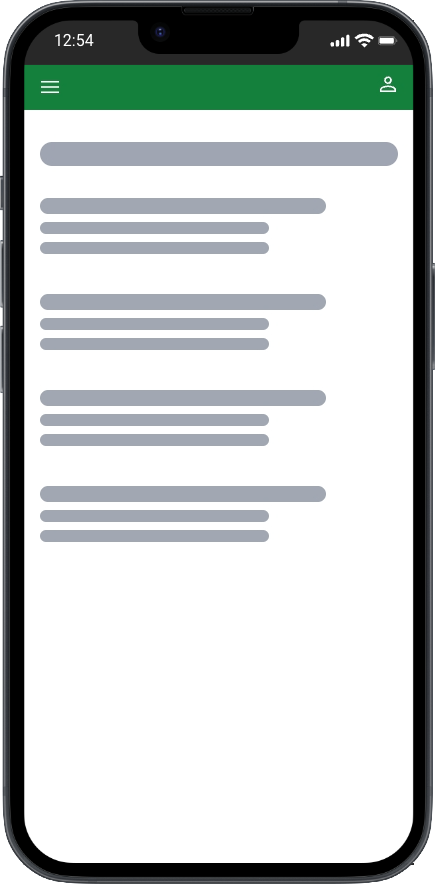
    </ImageWithCaption>
  </div>
</div>

<div style={{ width: '100%', flexDirection: 'row', justifyContent: 'center' }}>
  <div style={{ maxWidth: '720px', flexGrow: 1 }}>
    <ImageWithCaption caption="Project Page Skeleton on iPad">
      
    </ImageWithCaption>
  </div>
</div>

##### Listing the project's tasks

_`<ProjectPage>`_ renders two _`<TaskList>`_ components, one for _`pending`_ tasks, and another for _`completed`_ tasks.

To understand why we need that, let's understand the user experience requirements for this page.

To keep users focused on _`pending`_ tasks, we render them first, ordered by the date they were created, from oldest to newest (_`createdAt: 'asc'`_). Allowing users to reorder tasks by dragging and dropping them to meet their changing priorities would be a nice future enhancement.

Below the list of pending tasks, we want to render an _`Add task`_ button, making it convenient for users to create tasks.

However, we also want to allow users to easily reach their _`completed`_ tasks for future reference or revert them to _`pending`_ whenever necessary. Since that's a low-priority use case, we want to render that list below our _`Add task`_ button, and we want it ordered by the date they were completed, from newest to oldest (_`completedAt: 'desc'`_).

Those orderings are sensible defaults implemented in the [_`getTasks()`_](https://github.com/flsilva/opentask/blob/feb-2024/src/features/app/tasks/data-access/TasksDataAccess.ts#L133) function, implemented in [_`TasksDataAccess.ts`_](https://github.com/flsilva/opentask/blob/feb-2024/src/features/app/tasks/data-access/TasksDataAccess.ts) and called by [_`<TaskList>`_](https://github.com/flsilva/opentask/blob/feb-2024/src/features/app/tasks/ui/TaskList.tsx) (further explained).

I designed a flexible yet simple [_`<TaskList>`_](https://github.com/flsilva/opentask/blob/feb-2024/src/features/app/tasks/ui/TaskList.tsx) component to meet those UX requirements. All we have to do is pass _`only="pending"`_ or _` only="completed"`_ to it.

Since we order those two task lists differently, we have to render two separate lists in [_`<ProjectPage>`_](https://github.com/flsilva/opentask/blob/feb-2024/src/app/app/projects/%5BprojectId%5D/page.tsx).

You can play with it by creating and completing tasks to see how they get ordered.

The _`only`_ filter is optional, so we can render a list of pending _and_ completed tasks if we have a use case for that (we currently don't do that in OpenTask). We could only order the whole list by a single field, though.

#### Task pages and components

Routing module: [_`src/app/app/tasks`_](https://github.com/flsilva/opentask/tree/feb-2024/src/app/app/tasks)<br />
Feature module: [_`src/features/app/tasks`_](https://github.com/flsilva/opentask/tree/feb-2024/src/features/app/tasks)

Let's now move to the implementation of the task pages.

#### \<TaskList\> and \<TaskListItem\>

Since we've just seen how [_`<ProjectPage>`_](https://github.com/flsilva/opentask/blob/feb-2024/src/app/app/projects/%5BprojectId%5D/page.tsx) renders [_`<TaskList>`_](https://github.com/flsilva/opentask/blob/feb-2024/src/features/app/tasks/ui/TaskList.tsx), let's see how we implement it.

File: [_`src/features/app/tasks/ui/TaskList.tsx`_](https://github.com/flsilva/opentask/blob/feb-2024/src/features/app/tasks/ui/TaskList.tsx)

File: [_`src/features/app/tasks/ui/TaskListItem.tsx`_](https://github.com/flsilva/opentask/blob/feb-2024/src/features/app/tasks/ui/TaskListItem.tsx)

[_`<TaskList>`_](https://github.com/flsilva/opentask/blob/feb-2024/src/features/app/tasks/ui/TaskList.tsx) and [_`<TaskListItem>`_](https://github.com/flsilva/opentask/blob/feb-2024/src/features/app/tasks/ui/TaskListItem.tsx) are very similar to _`<ProjectList>`_ and _`<ProjectListItem>`_. _`<TaskList>`_ is a [full-stack component](/blog/react-server-components-and-a-new-hybrid-web-app-model/#building-full-stack-react-components), too.

We've just seen how easy it is to reuse and compose _`<TaskList>`_ in the _`<ProjectPage>`_, and we'll see how we do that in the [_`<TodayPage>`_](https://github.com/flsilva/opentask/blob/feb-2024/src/app/app/today/page.tsx) soon.

We expose a clean API for consumer components to filter what task data they want, just like we do with [_`<ProjectList>`_](https://github.com/flsilva/opentask/blob/feb-2024/src/features/app/projects/ui/ProjectList.tsx).

_`<TaskList>`_ exposes a richer API with more filtering options, and it uses the [_`getTasks()`_](https://github.com/flsilva/opentask/blob/feb-2024/src/features/app/tasks/data-access/TasksDataAccess.ts#L133) function to fetch tasks.

[_`getTasks()`_](https://github.com/flsilva/opentask/blob/feb-2024/src/features/app/tasks/data-access/TasksDataAccess.ts#L133) receives an object of type _`GetTasksParams`_:

```tsx
export interface GetTasksParams {
  readonly byProject?: string;
  readonly dueBy?: Date;
  readonly dueOn?: Date;
  readonly only?: 'completed' | 'incomplete';
  readonly onlyProject?: 'active' | 'archived';
  readonly orderBy?: 'completedAtAsc' | 'completedAtDesc' | 'createdAtAsc' | 'createdAtDesc';
}
```

_`<TaskList>`_ extends that interface to allow all those filtering options.

Here's the entire code for it:

```tsx TaskList.tsx
'use server';

import 'server-only';
import { twMerge } from 'tailwind-merge';
import { ClassNamePropsOptional } from '@/features/shared/ui/ClassNameProps';
import { getServerSideUser } from '@/features/app/users/data-access/UsersDataAccess';
import { GetTasksParams, TaskDto, getTasks } from '../data-access/TasksDataAccess';
import { TaskListItem } from './TaskListItem';
import { ErrorList } from '@/features/shared/ui/error/ErrorList';

export interface TaskListProps extends GetTasksParams, ClassNamePropsOptional {
  readonly children?: ({
    list,
    tasks,
  }: {
    readonly list: React.ReactNode;
    readonly tasks: Array<TaskDto>;
  }) => React.ReactNode;
}

/*
 * I'm suppressing the following TypeScript error that seems to be an issue
 * with React types for async components:
 *
 * "Type is referenced directly or indirectly in the fulfillment callback of its own 'then' method.ts(1062)"
 */
// @ts-ignore
export const TaskList = async ({ children, className, ...rest }: TaskListProps) => {
  const [{ timeZone }, { data: tasks, errors }] = await Promise.all([
    getServerSideUser(),
    getTasks(rest),
  ]);

  if (errors) return <ErrorList errors={errors} />;

  let list = null;

  if (tasks && tasks.length > 0) {
    list = (
      <div className={twMerge('flex flex-col', className)}>
        {tasks.map((task) => (
          <div key={task.id} className="flex mb-4 last:mb-0">
            <TaskListItem
              completedAt={task.completedAt}
              description={task.description || ''}
              dueDate={task.dueDate}
              id={task.id}
              key={task.id}
              name={task.name}
              timeZone={timeZone}
            />
          </div>
        ))}
      </div>
    );
  }

  return typeof children === 'function' ? children({ list, tasks: tasks ?? [] }) : list;
};
```

We ignore the same TypeScript error as in _`<ProjectList>`_.

Notice that _`<TaskList>`_ supports receiving an optional _`children`_ prop of a custom function type.

When we pass such a function as _`children`_ to _`<TaskList>`_, it calls it passing two arguments, _`list: React.ReactNode`_ and _`tasks: Array<TaskDto>`_. Instead of returning the task list JSX, it passes that JSX to the function alongside an array of tasks and returns the function call result.

That means the function passed as _`children`_ must return a valid _`React.ReactNode`_ object.

As we'll see soon, we leverage that API in the _`<TodayPage>`_.

[_`<TaskListItem>`_](https://github.com/flsilva/opentask/blob/feb-2024/src/features/app/tasks/ui/TaskListItem.tsx), on the other hand, is a [Shared Component](/blog/react-server-components-and-a-new-hybrid-web-app-model/#what-are-shared-components), as it doesn't consume any server or client-only APIs.

Here's the entire code for it:

```tsx TaskListItem.tsx
import Link from 'next/link';
import { sanitize } from 'isomorphic-dompurify';
import { utcToZonedTime } from 'date-fns-tz';
import { CalendarEventIcon } from '@/features/shared/ui/icon/CalendarEventIcon';
import { ClassNamePropsOptional } from '@/features/shared/ui/ClassNameProps';
import { TaskCheck } from './TaskCheck';
import { TaskCheckSize } from './TaskCheckSize';
import { twJoin, twMerge } from 'tailwind-merge';
import { formatTaskDueDate } from './formatTaskDueDate';

export interface TaskListItemProps extends ClassNamePropsOptional {
  readonly completedAt: Date | null | undefined;
  readonly description: string;
  readonly dueDate: Date | null | undefined;
  readonly id: string;
  readonly name: string;
  readonly timeZone: string;
}

export const TaskListItem = ({
  className,
  completedAt,
  description,
  dueDate,
  id,
  name,
  timeZone,
}: TaskListItemProps) => {
  return (
    <div
      className={twMerge(
        'flex grow py-4 border-y border-transparent hover:border-gray-100',
        className,
      )}
    >
      <TaskCheck
        className="mt-0.25"
        completedAt={completedAt}
        size={TaskCheckSize.Medium}
        taskId={id}
      />
      <Link href={`/app/tasks/${id}`} className="flex grow text-left cursor">
        <div className="ml-3 block">
          <div
            className={twJoin('text-sm text-gray-800', completedAt && 'line-through')}
            dangerouslySetInnerHTML={{ __html: sanitize(name) }}
          />
          {description && (
            <div
              className="mt-2 block w-[20rem] overflow-hidden text-ellipsis whitespace-nowrap text-xs text-gray-400 md:w-[26rem] lg:w-[40rem]"
              dangerouslySetInnerHTML={{ __html: sanitize(description) }}
            />
          )}
          {dueDate && (
            <div className="flex mt-2">
              <CalendarEventIcon className="fill-gray-400" width="0.875rem" height="0.875rem" />
              <p className="text-xs text-gray-400 ml-1">
                {formatTaskDueDate(
                  utcToZonedTime(dueDate, timeZone),
                  utcToZonedTime(new Date(), timeZone),
                )}
              </p>
            </div>
          )}
        </div>
      </Link>
    </div>
  );
};
```

#### getTasks()

[_`getTasks()`_](https://github.com/flsilva/opentask/blob/feb-2024/src/features/app/tasks/data-access/TasksDataAccess.ts#L133) is similar to [_`getProjects()`_](https://github.com/flsilva/opentask/blob/feb-2024/src/features/app/projects/data-access/ProjectsDataAccess.ts#L97), just a little more elaborated to support more filtering options.

#### \<AddTask\>, \<NewTaskDialogPage\>, and \<NewTaskPage\>

[_`<ProjectPage>`_](https://github.com/flsilva/opentask/blob/feb-2024/src/app/app/projects/%5BprojectId%5D/page.tsx) renders [_`<AddTask>`_](https://github.com/flsilva/opentask/blob/feb-2024/src/features/app/tasks/ui/AddTask.tsx), which renders the _`Add task`_ button.

The file for [_`<AddTask>`_](https://github.com/flsilva/opentask/blob/feb-2024/src/features/app/tasks/ui/AddTask.tsx) is located at [_`src/features/app/tasks/ui/AddTask.tsx`_](https://github.com/flsilva/opentask/blob/feb-2024/src/features/app/tasks/ui/AddTask.tsx).

When we click the _`Add task`_ button on small screens (_`width < 768`_), we navigate to _`/app/tasks/new`_. We have an Intercepting Route set up for it that renders [_`<NewTaskDialogPage>`_](<https://github.com/flsilva/opentask/blob/feb-2024/src/app/app/%40dialog/(.)tasks/new/page.tsx>), located at [_`src/app/app/@dialog/(.)tasks/new/page.tsx`_](<https://github.com/flsilva/opentask/blob/feb-2024/src/app/app/%40dialog/(.)tasks/new/page.tsx>):

<div style={{ width: '100%', flexDirection: 'row', justifyContent: 'center' }}>
  <div style={{ maxWidth: '280px', flexGrow: 1 }}>
    <ImageWithCaption caption="New Task Dialog Page on iPhone">
      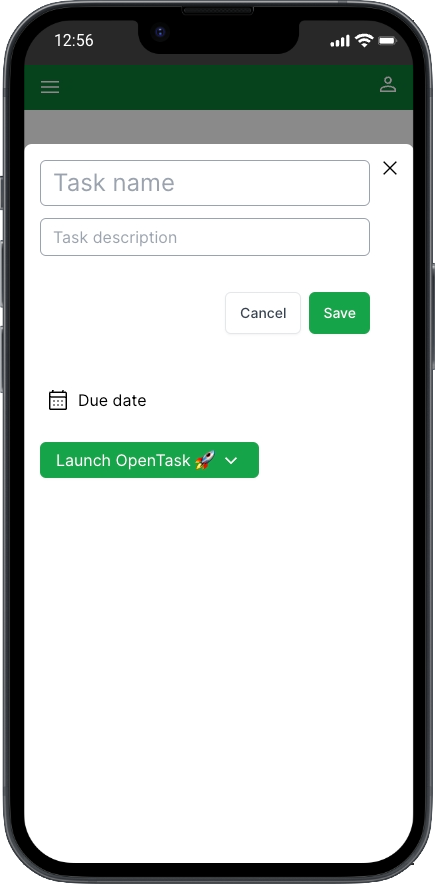
    </ImageWithCaption>
  </div>
</div>

Here's the entire code for it:

```tsx page.tsx
import { Dialog } from '@/features/shared/ui/dialog/Dialog';
import { RouterActions } from '@/features/shared/routing/RouterActions';
import { TaskForm } from '@/features/app/tasks/ui/TaskForm';

interface NewTaskDialogPageProps {
  readonly searchParams: { readonly projectId: string };
}

export default function NewTaskDialogPage({ searchParams: { projectId } }: NewTaskDialogPageProps) {
  return (
    <Dialog defaultOpen routerActionOnClose={RouterActions.BackAndRefresh}>
      <TaskForm projectId={projectId} startOnEditingMode taskNameClassName="text-2xl" />
    </Dialog>
  );
}
```

Does it remind you something? Yep, it's just like [_`<NewProjectDialogPage>`_](<https://github.com/flsilva/opentask/blob/feb-2024/src/app/app/%40dialog/(.)projects/new/page.tsx>).

If we refresh the browser while at _`/app/tasks/new`_, we render a regular route component too, [_`<NewTaskPage>`_](https://github.com/flsilva/opentask/blob/feb-2024/src/app/app/tasks/new/page.tsx), located at [_`src/app/app/tasks/new/page.tsx`_](https://github.com/flsilva/opentask/blob/feb-2024/src/app/app/tasks/new/page.tsx):

<div style={{ width: '100%', flexDirection: 'row', justifyContent: 'center' }}>
  <div style={{ maxWidth: '280px', flexGrow: 1 }}>
    <ImageWithCaption caption="New Task Page on iPhone">
      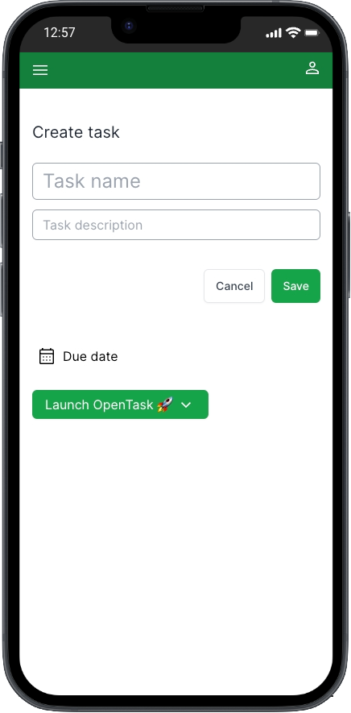
    </ImageWithCaption>
  </div>
</div>

Here's the entire code for it:

```tsx page.tsx
import { TaskForm } from '@/features/app/tasks/ui/TaskForm';

interface NewTaskPageProps {
  readonly searchParams: { readonly projectId: string };
}

export default function NewTaskPage({ searchParams: { projectId } }: NewTaskPageProps) {
  return (
    <div className="flex flex-col mt-10">
      <h1 className="mb-6 text-xl text-gray-800">Create task</h1>
      <TaskForm projectId={projectId} startOnEditingMode taskNameClassName="text-2xl" />
    </div>
  );
}
```

That, too, looks a lot like [_`<NewProjectPage>`_](https://github.com/flsilva/opentask/blob/feb-2024/src/app/app/projects/new/page.tsx).

However, when we're on larger screens (_`width >= 768`_), we render the [_`<TaskForm>`_](https://github.com/flsilva/opentask/blob/feb-2024/src/features/app/tasks/ui/TaskForm.tsx) in place:

<div style={{ width: '100%', flexDirection: 'row', justifyContent: 'center' }}>
  <div style={{ maxWidth: '720px', flexGrow: 1 }}>
    <ImageWithCaption caption="Project Page with New Task Form on iPad">
      
    </ImageWithCaption>
  </div>
</div>

Rendering [_`<TaskForm>`_](https://github.com/flsilva/opentask/blob/feb-2024/src/features/app/tasks/ui/TaskForm.tsx) in place on large screens results in a more fluid UX, allowing users to get instant feedback by seeing created tasks rendered in the task list.

That's how Todoist does it, and I wanted to try that even though it's more complex to implement. Since this is an engineering study, and OpenTask is pretty simple, I liked the idea of facing this problem.

We pass _`<TaskForm>`_ as _`<AddTask>`_'s _`children`_ to allow it to render _`<TaskForm>`_ in place.

Let's recap how [_`<ProjectPage>`_](https://github.com/flsilva/opentask/blob/feb-2024/src/app/app/projects/%5BprojectId%5D/page.tsx) renders _`<AddTask>`_:

```tsx page.tsx
<AddTask containerClassName="my-8" projectId={projectId}>
  <TaskForm
    className="rounded-md bg-gray-100 px-2 py-6 sm:px-6 mt-4"
    projectId={projectId}
    startOnEditingMode
  />
</AddTask>
```

That's another example of Interleaving Server and Client Components: _`<AddTask>`_ is a Client Component that receives _`<TaskForm>`_ Server Component as _`children`_ and renders it.

Here's the entire code for [_`<AddTask>`_](https://github.com/flsilva/opentask/blob/feb-2024/src/features/app/tasks/ui/AddTask.tsx), except for a comment that I'll reproduce below:

```tsx AddTask.tsx
'use client';

import 'client-only';
import { Fragment } from 'react';
import { usePathname, useRouter, useSearchParams } from 'next/navigation';
import { useWindowSize } from 'usehooks-ts';
import { Transition } from '@headlessui/react';
import { twJoin, twMerge } from 'tailwind-merge';
import { ClassNamePropsOptional } from '@/features/shared/ui/ClassNameProps';
import { ChildrenProps } from '@/features/shared/ui/ChildrenProps';
import { buttonLinkClassName } from '@/features/shared/ui/control/button/buttonClassName';
import { PlusSignalIcon } from '@/features/shared/ui/icon/PlusSignalIcon';

export interface AddTaskProps extends ChildrenProps, ClassNamePropsOptional {
  readonly containerClassName?: string;
  readonly defaultDueDate?: 'today';
  readonly projectId?: string;
}

export const AddTask = ({
  children,
  className,
  containerClassName,
  defaultDueDate,
  projectId,
}: AddTaskProps) => {
  const router = useRouter();
  const pathname = usePathname();
  const searchParams = useSearchParams();
  const { width } = useWindowSize();

  const isAddingTask = () => searchParams.get('newTask') !== null;

  const onAddTask = () => {
    if (width >= 768) {
      router.replace(`${pathname}?newTask=true`);
    } else {
      const newTaskSearchParams = new URLSearchParams();
      if (defaultDueDate === 'today') {
        newTaskSearchParams.set('defaultDueDate', 'today');
      }
      if (projectId) newTaskSearchParams.set('projectId', projectId);
      router.push(`/app/tasks/new?${newTaskSearchParams.toString()}`);
    }
  };

  return (
    <div className={twJoin(containerClassName)}>
      <Transition
        show={!isAddingTask()}
        as={Fragment}
        enter="ease-out duration-300"
        enterFrom="opacity-0 -translate-y-[50px]"
        enterTo="opacity-100 translate-y-0"
        leave="ease-in duration-200"
        leaveFrom="opacity-100 translate-y-0"
        leaveTo="opacity-0 -translate-y-[50px]"
      >
        <button
          onClick={onAddTask}
          className={twMerge(buttonLinkClassName, 'group py-4  flex-row self-start', className)}
        >
          <PlusSignalIcon
            width="1.25rem"
            height="1.25rem"
            className="fill-gray-600 mr-1 group-hover:fill-green-600"
          />
          Add task
        </button>
      </Transition>
      <Transition
        show={isAddingTask()}
        as="div"
        enter="ease-out duration-300"
        enterFrom="opacity-0 translate-y-[50px]"
        enterTo="opacity-100 translate-y-0"
        leave="ease-in duration-200"
        leaveFrom="opacity-100 translate-y-0"
        leaveTo="opacity-0 translate-y-[50px]"
      >
        {children}
      </Transition>
    </div>
  );
};
```

We lift _`newTask=true`_ state to the URL instead of using [_`useState()`_ ](https://react.dev/reference/react/useState)to make it possible to have a _`cancel`_ button in _`<TaskForm>`_ that removes that state from the URL, which makes _`<AddTask>`_ to stop rendering _`<TaskForm>`_.

That effectvely allows _`<TaskForm>`_ to communicate with _`<AddTask>`_.

We pass _`<TaskForm>`_ as _`children`_ to _`<AddTask>`_. So, _`<TaskForm>`_ cannot pass props to _`<AddTask>`_ to tell it to stop rendering itself.

And since _`<TaskForm>`_ is a Server Component, we cannot clone it in _`<AddTask>`_ to pass a function to it to be called when clicking _`cancel`_.

We cannot pass functions from Client Components to Server Components.

We only have to remove _`newTask=true`_ state from the URL when [clicking the _cancel_ button](https://github.com/flsilva/opentask/blob/feb-2024/src/features/app/tasks/ui/TaskFormFields.tsx#L196).

Here's how we do that:

```tsx TaskFormFields.tsx
...
import { usePathname } from 'next/navigation';
...
const pathname = usePathname();
...
onClick={() => {
  router.replace(pathname);
}}
...
```

I extracted the code above from [_`<TaskFormFields>`_](https://github.com/flsilva/opentask/blob/feb-2024/src/features/app/tasks/ui/TaskFormFields.tsx), a Client Component rendered by _`<TaskForm>`_, further explained.

We use the URL as a shared global state.

_`<AddTask>`_ _listens_ to that URL change, rerenders, and this time its local _`isAddingTask()`_ function returns false, which makes it stop rendering _`<TaskForm>`_.

That works well in many use cases, but this one feels a bit hacky. The use case is tricky, though.

I'd love to solve it in a better way. If you have an idea, please share it in the [discussions](https://github.com/flsilva/opentask/discussions), [comments](#post-comments), or [ping me on X](https://twitter.com/flsilva7).

Before moving to _`<TaskForm>`_, let's look into [_`<TaskDialogPage>`_](<https://github.com/flsilva/opentask/blob/feb-2024/src/app/app/%40dialog/(.)tasks/%5BtaskId%5D/page.tsx>) and [_`<TaskPage>`_](https://github.com/flsilva/opentask/blob/feb-2024/src/app/app/tasks/%5BtaskId%5D/page.tsx).

#### \<TaskDialogPage\> and \<TaskPage\>

When we click a _`<TaskListItem>`_ in the _`<ProjectPage>`_, we navigate to _`/app/tasks/[taskId]`_. We have an Intercepting Route set up for it that renders [_`<TaskDialogPage>`_](<https://github.com/flsilva/opentask/blob/feb-2024/src/app/app/%40dialog/(.)tasks/%5BtaskId%5D/page.tsx>):

<div style={{ width: '100%', flexDirection: 'row', justifyContent: 'center' }}>
  <div style={{ maxWidth: '280px', flexGrow: 1 }}>
    <ImageWithCaption caption="Task Dialog Page on iPhone">
      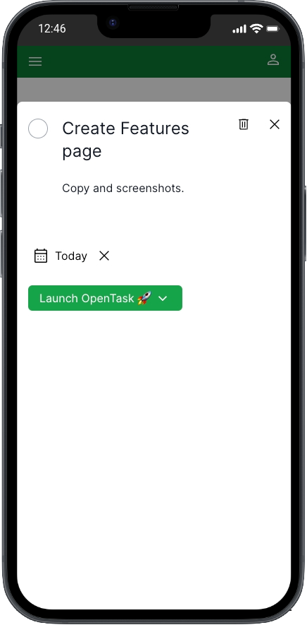
    </ImageWithCaption>
  </div>
</div>

<div style={{ width: '100%', flexDirection: 'row', justifyContent: 'center' }}>
  <div style={{ maxWidth: '720px', flexGrow: 1 }}>
    <ImageWithCaption caption="Task Dialog Page on iPad">
      
    </ImageWithCaption>
  </div>
</div>

Here's the entire code for [_`<TaskDialogPage>`_](<https://github.com/flsilva/opentask/blob/feb-2024/src/app/app/%40dialog/(.)tasks/%5BtaskId%5D/page.tsx>), except for a comment that I reproduce below:

```tsx page.tsx
import { Suspense } from 'react';
import { DeleteIconButton } from '@/features/shared/ui/control/button/DeleteIconButton';
import { Dialog } from '@/features/shared/ui/dialog/Dialog';
import { RouterActions } from '@/features/shared/routing/RouterActions';
import { DeleteTaskAlertDialog } from '@/features/app/tasks/ui/DeleteTaskAlertDialog';
import { TaskForm } from '@/features/app/tasks/ui/TaskForm';
import { TaskFormSkeletonSkeleton } from '@/features/app/tasks/ui/TaskFormSkeleton';

interface TaskDialogPageProps {
  readonly params: { readonly taskId: string };
}

export default function TaskDialogPage({ params: { taskId } }: TaskDialogPageProps) {
  const deleteTaskDialog = (
    <DeleteTaskAlertDialog
      id={taskId}
      routerActionOnSubmitSuccess={RouterActions.BackAndRefresh}
      trigger={<DeleteIconButton className="mr-2" />}
    />
  );

  return (
    <Dialog
      defaultOpen
      headerButtons={deleteTaskDialog}
      routerActionOnClose={RouterActions.BackAndRefresh}
    >
      <Suspense fallback={<TaskFormSkeletonSkeleton className="mt-6" ssrOnly="Loading task..." />}>
        <TaskForm taskId={taskId} taskNameClassName="text-2xl" />
      </Suspense>
    </Dialog>
  );
}
```

We have to use [_`RouterActions.BackAndRefresh`_](https://github.com/flsilva/opentask/blob/feb-2024/src/features/shared/routing/RouterActions.tsx#L17) to force a call to [_`router.refresh()`_](https://nextjs.org/docs/app/api-reference/functions/use-router#userouter) after navigating back to the previous route, which is **not** an Intercepting Route, so _`router.refresh()`_ _works_.

We need that because we cannot call [_`revalidatePath()`_](https://nextjs.org/docs/app/api-reference/functions/revalidatePath) or [_`revalidateTag()`_](https://nextjs.org/docs/app/api-reference/functions/revalidateTag) from Parallel Routes or Intercepting Routes like [_`<TaskDialogPage>`_](<https://github.com/flsilva/opentask/blob/feb-2024/src/app/app/%40dialog/(.)tasks/%5BtaskId%5D/page.tsx>), due to a well-known App Router bug I describe in a following section as well as comments in the [_`<TaskFormTextFields>`_](https://github.com/flsilva/opentask/blob/feb-2024/src/features/app/tasks/ui/TaskFormFields.tsx) and [_`<TaskCheck>`_](https://github.com/flsilva/opentask/blob/feb-2024/src/features/app/tasks/ui/TaskCheck.tsx) source code.

So if we go back without calling _`router.refresh()`_, the updates we make in tasks using _`<TaskForm>`_ will not be reflected in the UI.

If we refresh the browser while at _`/app/tasks/[taskId]`_, we render a regular route component [_`<TaskPage>`_](https://github.com/flsilva/opentask/blob/feb-2024/src/app/app/tasks/%5BtaskId%5D/page.tsx), located at [_`src/app/app/tasks/page.tsx`_](https://github.com/flsilva/opentask/blob/feb-2024/src/app/app/tasks/%5BtaskId%5D/page.tsx):

<div style={{ width: '100%', flexDirection: 'row', justifyContent: 'center' }}>
  <div style={{ maxWidth: '280px', flexGrow: 1 }}>
    <ImageWithCaption caption="Task Page on iPhone">
      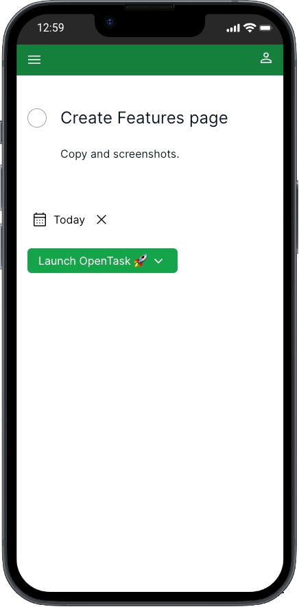
    </ImageWithCaption>
  </div>
</div>

<div style={{ width: '100%', flexDirection: 'row', justifyContent: 'center' }}>
  <div style={{ maxWidth: '720px', flexGrow: 1 }}>
    <ImageWithCaption caption="Task Page on iPad">
      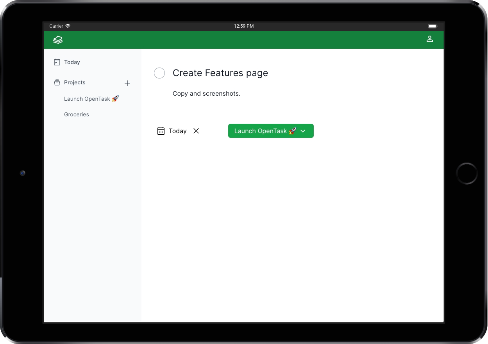
    </ImageWithCaption>
  </div>
</div>

Here's the entire code for it:

```tsx page.tsx
import { TaskForm } from '@/features/app/tasks/ui/TaskForm';

interface TaskPageProps {
  readonly params: { readonly taskId: string };
}

export default function TaskPage({ params: { taskId } }: TaskPageProps) {
  return <TaskForm className="mt-10" taskId={taskId} taskNameClassName="text-2xl" />;
}
```

These pages render _`<TaskForm>`_, which display tasks and allow users to create and edit them, too, as we see next.

#### \<TaskForm\>

File: [_`src/features/app/tasks/ui/TaskForm.tsx`_](https://github.com/flsilva/opentask/blob/feb-2024/src/features/app/tasks/ui/TaskForm.tsx)

By now, you might have noticed how flexible, reusable, and composable [_`<TaskForm>`_](https://github.com/flsilva/opentask/blob/feb-2024/src/features/app/tasks/ui/TaskForm.tsx) is.

We use _`<TaskForm>`_ to create, edit, and display tasks.

We render it in [_`<NewTaskDialogPage>`_](<https://github.com/flsilva/opentask/blob/feb-2024/src/app/app/%40dialog/(.)tasks/new/page.tsx>), [_`<NewTaskPage>`_](https://github.com/flsilva/opentask/blob/feb-2024/src/app/app/tasks/new/page.tsx), [_`<TaskDialogPage>`_](<https://github.com/flsilva/opentask/blob/feb-2024/src/app/app/%40dialog/(.)tasks/%5BtaskId%5D/page.tsx>), [_`<TaskPage>`_](https://github.com/flsilva/opentask/blob/feb-2024/src/app/app/tasks/%5BtaskId%5D/page.tsx), [_`<ProjectPage>`_](https://github.com/flsilva/opentask/blob/feb-2024/src/app/app/projects/%5BprojectId%5D/page.tsx) (to pass it as children of _`<AddTask>`_), and [_`<TodayPage>`_](https://github.com/flsilva/opentask/blob/feb-2024/src/app/app/today/page.tsx) (which we'll see soon, but works the same as _`<ProjectPage>`_).

Even though _`<TaskForm>`_ is considerably more complex than _`<ProjectForm>`_, because it has more fields, including a Date Picker and a Select, I wanted to implement it following the same patterns.

_`<TaskForm>`_ is a Server Component that fetches task data when we're editing tasks, i.e., when we pass a _`taskId`_, just like _`<ProjectForm>`_.

But there's a bug in Next.js that prevents us from calling _`revalidateTag()`_, _`revalidatePath()`_, and _`router.refresh()`_ in Server Actions triggered by Intercepting Routes—the routing breaks.

I could reproduce it and [reported it here](https://github.com/vercel/next.js/issues/60950).

I could find more reports related to the same issue: [#51310](https://github.com/vercel/next.js/issues/51310), [#51714](https://github.com/vercel/next.js/issues/51714), [#60814](https://github.com/vercel/next.js/issues/60814), [#60815](https://github.com/vercel/next.js/issues/60815), and [#60844](https://github.com/vercel/next.js/issues/60844).

When we call _`revalidateTag()`_ or _`revalidatePath()`_ in a Server Action from a regular route, which does work, React and App Router rerender the React component tree, starting from the top-level component, which is usually a Server Component, all the way down to leave components, which can be Server or Client Components. React preserves the client-side state when it does that, so the UI updates as expected, not like a hard refresh.

But we cannot do that from Intercepting Routes, like _`<TaskDialogPage>`_. So I couldn't implement _`<TaskForm>`_ as I implemented _`<ProjectForm>`_.

I kept _`<TaskForm>`_ as a Server Component to preserve the ability to fetch _`task`_ data when editing tasks, making it as reusable and composable as _`<ProjectForm>`_.

But to work around that bug, I created [_`<TaskFormFields>`_](https://github.com/flsilva/opentask/blob/feb-2024/src/features/app/tasks/ui/TaskFormFields.tsx), a Client Component that handles all the form logic for _`<TaskForm>`_. We need a Client Component because we have to _`useState()`_ to store the current _`task`_ object, much like when building React apps without Server Components and Server Actions.

Because of that, the implementation of _`<TaskForm>`_ + _`<TaskFormFields>`_ is more complex and verbose than _`<ProjectForm>`_.

I also had to work around that bug in [_`<TaskCheck>`_](https://github.com/flsilva/opentask/blob/feb-2024/src/features/app/tasks/ui/TaskCheck.tsx). That's the round button we use to complete tasks and revert them to pending.

The Next.js core team is doing incredible work with the new App Router. I'm confident they'll fix that bug as soon as possible.

The workaround I implemented is a temporary fix. Once that bug is fixed, I will refactor _`<TaskForm>`_ and related components to leverage _`revalidateTag()`_, and I expect the code to be much simpler and cleaner.

Because of that, I won't explain the workaround here. It'd make this article longer to explain a fix I'll hopefully discard soon.

If you're facing the same problem and looking for a workaround, check the codebase to see how I implemented it. Let me know if you have any questions or suggestions.

#### createTask()

The [_`createTask()`_](https://github.com/flsilva/opentask/blob/feb-2024/src/features/app/tasks/data-access/TasksDataAccess.ts#L48) Server Action is very similar to _`createProject()`_ and is located at [_`src/features/app/tasks/data-access/TasksDataAccess.ts`_](https://github.com/flsilva/opentask/blob/feb-2024/src/features/app/tasks/data-access/TasksDataAccess.ts).

The [_`updateTask()`_](https://github.com/flsilva/opentask/blob/feb-2024/src/features/app/tasks/data-access/TasksDataAccess.ts#L222) Server Action is very similar to _`createTask()`_.

#### \<TodayPage\>

<div style={{ width: '100%', flexDirection: 'row', justifyContent: 'center' }}>
  <div style={{ maxWidth: '280px', flexGrow: 1 }}>
    <ImageWithCaption caption="Today Page on iPhone">
      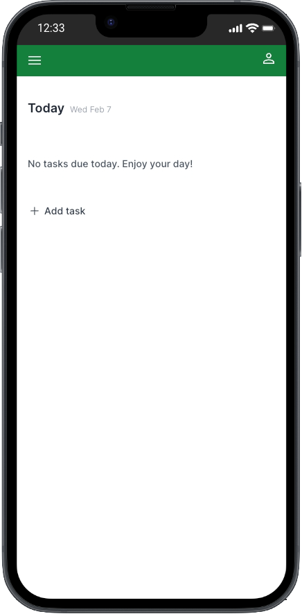
    </ImageWithCaption>
  </div>
</div>

<div style={{ width: '100%', flexDirection: 'row', justifyContent: 'center' }}>
  <div style={{ maxWidth: '720px', flexGrow: 1 }}>
    <ImageWithCaption caption="Today Page on iPad">
      
    </ImageWithCaption>
  </div>
</div>

File: [_`src/app/app/today/page.tsx`_](https://github.com/flsilva/opentask/blob/feb-2024/src/app/app/today/page.tsx)

The goal of [_`<TodayPage>`_](https://github.com/flsilva/opentask/blob/feb-2024/src/app/app/today/page.tsx) is to help users see what to work on today and manage their overdue tasks.

The code is similar to [_`<ProjectPage>`_](https://github.com/flsilva/opentask/blob/feb-2024/src/app/app/projects/%5BprojectId%5D/page.tsx). It also renders [_`<AddTask>`_](https://github.com/flsilva/opentask/blob/feb-2024/src/features/app/tasks/ui/AddTask.tsx) and two [_`<TaskList>`_](https://github.com/flsilva/opentask/blob/feb-2024/src/features/app/tasks/ui/TaskList.tsx) components, one filtering _`pending`_ tasks that are overdue, and another filtering _`pending`_ tasks due today.

Here's the entire code for it:

```tsx
import { Suspense } from 'react';
import { redirect } from 'next/navigation';
import { subDays } from 'date-fns';
import { ErrorList } from '@/features/shared/ui/error/ErrorList';
import { getProjects } from '@/features/app/projects/data-access/ProjectsDataAccess';
import { AddTask } from '@/features/app/tasks/ui/AddTask';
import { TaskForm } from '@/features/app/tasks/ui/TaskForm';
import { TaskList } from '@/features/app/tasks/ui/TaskList';
import { TaskListSkeleton } from '@/features/app/tasks/ui/TaskListSkeleton';
import { TodayPageHeader } from '@/features/app/today/ui/TodayPageHeader';

export default async function TodayPage() {
  const { data: projects, errors } = await getProjects();
  if (errors) return <ErrorList errors={errors} />;
  if (!projects || projects.length <= 0) redirect('/app/onboarding');

  const yesterday = subDays(new Date(), 1);
  const today = new Date();

  return (
    <>
      <TodayPageHeader />
      <Suspense fallback={<TaskListSkeleton className="mt-3" ssrOnly="Loading tasks..." />}>
        <TaskList dueBy={yesterday} only="incomplete" onlyProject="active">
          {({ list: listOverdue, tasks: tasksOverdue }) => (
            <>
              {tasksOverdue.length > 0 && <p className="mb-4 text-xs font-semibold">Overdue</p>}
              {listOverdue}
              {tasksOverdue.length > 0 && <p className="mt-8 mb-4 text-xs font-semibold">Today</p>}

              <TaskList dueOn={today} only="incomplete" onlyProject="active">
                {({ list: listDueToday, tasks: tasksDueToday }) => (
                  <>
                    {listDueToday}
                    {tasksDueToday.length < 1 && (
                      <p className="mt-6 mb-6 text-sm font-medium text-gray-600">
                        No tasks due today. {tasksOverdue.length < 1 && 'Enjoy your day!'}
                      </p>
                    )}
                  </>
                )}
              </TaskList>
            </>
          )}
        </TaskList>
        <AddTask containerClassName="my-8" defaultDueDate="today">
          <TaskForm
            className="rounded-md bg-gray-100 px-2 py-6 sm:px-6 mt-4"
            defaultDueDate={today}
            startOnEditingMode
          />
        </AddTask>
      </Suspense>
    </>
  );
}
```

The first thing to notice is that we redirect users to _`/app/onboarding`_ when they don't have any projects. That happens after their first sign-in.

As mentioned earlier, we pass a function as _`children`_ to _`<TaskList>`_ to get the JSX of the task list and the filtered task array.

We have to do that because, on this page, we render **Overdue** and **Today** titles under certain data conditions alongside other messages. That means we must access the array of overdue tasks and the tasks due today from the page component.

We also nest the _`<TaskList>`_ component for tasks due today under the _`<TaskList>`_ component for overdue tasks.

You might think there's something wrong, but let's understand the user experience requirements for this page to understand why we need that.

##### Use case A: The user has no projects (so no tasks)

In this case, we redirect them to _`/app/onboarding`_, where we clarify that they should create their first project.

##### Use case B: The user has no tasks overdue nor due today

We display _`No tasks due today. Enjoy your day!`_ and the _`Add task`_ button.

<div style={{ width: '100%', flexDirection: 'row', justifyContent: 'center' }}>
  <div style={{ maxWidth: '280px', flexGrow: 1 }}>
    <ImageWithCaption caption="Today Page on iPhone">
      
    </ImageWithCaption>
  </div>
</div>

##### Use case C: The user has tasks due today and no overdue tasks

We display tasks due today.

<div style={{ width: '100%', flexDirection: 'row', justifyContent: 'center' }}>
  <div style={{ maxWidth: '280px', flexGrow: 1 }}>
    <ImageWithCaption caption="Today Page on iPhone">
      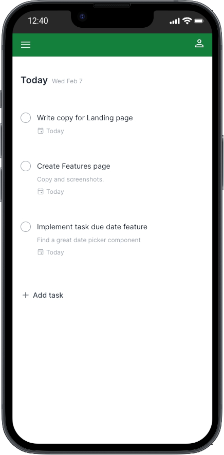
    </ImageWithCaption>
  </div>
</div>

##### Use case D: The user has tasks due today and overdue

We display an _`Overdue`_ title, overdue tasks below it, then a _`Today`_ title, and tasks due today below it.

<div style={{ width: '100%', flexDirection: 'row', justifyContent: 'center' }}>
  <div style={{ maxWidth: '280px', flexGrow: 1 }}>
    <ImageWithCaption caption="Today Page on iPhone">
      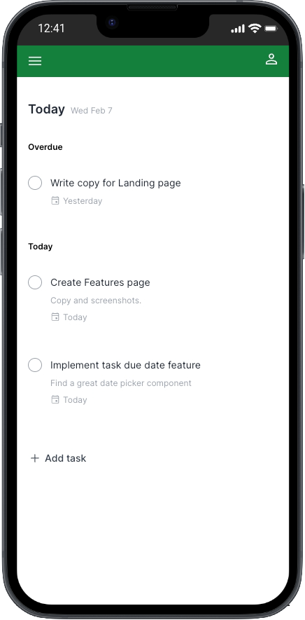
    </ImageWithCaption>
  </div>
</div>

##### Use case E: The user has tasks overdue and no tasks due today

We display an _`Overdue`_ title, the overdue tasks below it, then a _`Today`_ title, and the message _`No tasks due today.`_.

<div style={{ width: '100%', flexDirection: 'row', justifyContent: 'center' }}>
  <div style={{ maxWidth: '280px', flexGrow: 1 }}>
    <ImageWithCaption caption="Today Page on iPhone">
      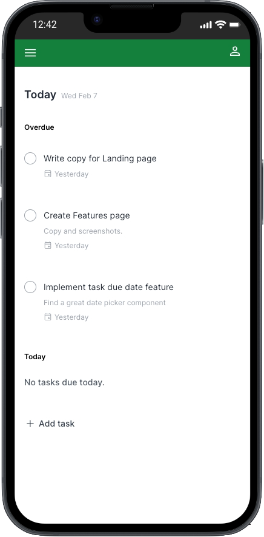
    </ImageWithCaption>
  </div>
</div>

##### Implementing the use cases

We have five different use cases for this page.

The code for both _`<TaskList>`_ rendering, with one nested inside the other, might initially seem overly complex, but after a few minutes, you might realize it's pretty simple.

We need to render the _`<TaskList>`_ for tasks due today inside the _`<TaskList>`_ for overdue tasks because we need to know if there are any overdue tasks within the _`<TaskList>`_ for tasks due today because we want to display a different message when there are no tasks due today nor overdue than when there are no tasks due today but there are overdue tasks.

In the first case, when no tasks are due today or overdue, we display _`No tasks due today. Enjoy your day!`_.

In the second case, when no tasks are due today, but there are overdue tasks, we display _`No tasks due today.`_. Notice that we omit the _`Enjoy your day!`_ phrase.

That's a small UI detail, but I wanted to handle more elaborate use cases to see how flexible this new way of building React components is.

It's very flexible.

Sometimes, we'll have to develop different or novel solutions, as this is a new model and way to build React components.

To support this use case by fine-tuning the UI, we designed an even more flexible _`<TaskList>`_ component that we can reuse and compose in different ways. At the same time, we don't have to worry about its data dependencies despite its rich data filtering API.

I'm happy with the result.

Instead of fine-tuning text messages, we could use graphics for each case or graphics alongside text.

**The bottom line is that we can meet simple use cases and more elaborate ones.**

The only downside for this solution is that we create a small network waterfall: only after the first _`<TaskList>`_ component fetches data from the database and finishes rendering by calling the _`children`_ function the nested _`<TaskList>`_ component is executed, also fetching data from the database.

In this case, I don't see it as a big problem. It's not ideal, of course, but both components render on the server, and both database queries are fast. Also, Next.js caches data, so only after users mutate task data is the cache cleared, and those two queries execute again.

However, there might be cases where a database query is slow, and we want to run those two queries in parallel. Then, we need to come up with another solution or compromise something, perhaps a more straightforward UI. We are, after all, making trade-offs all the time, and this is no different.

Another simple solution for this use case would be fetching overdue tasks twice, one as part of rendering _`<TaskList>`_ for overdue tasks, and another calling _`getTasks()`_ directly from _`<TodayPage>`_ and then using the result inside the _`<TaskList>`_ rendering for tasks due today, like the following:

```tsx
...
const yesterday = subDays(new Date(), 1);
const today = new Date();

const { data: overdueTasks, errors } = getTasks({
  dueBy: yesterday,
  only: 'incomplete',
  onlyProject: 'active'
});
...
return (
  ...
  <TaskList dueOn={today} only="incomplete" onlyProject="active">
    {({ list: listDueToday, tasks: tasksDueToday }) => (
      // use overdueTasks.length to handle the use cases
    )}
  </TaskList>
  ...
);
...
```

The upside of the above solution is that we no longer have a network waterfall; the downside is that we now query tasks three times instead of two. Trade-offs. It's a nice solution, though. I just wanted to try a more component-based one.

#### Not every implementation detail is covered

There are several small implementation details that I haven't covered here to avoid having an even longer article. But I invite you to browse the codebase. It is clean and easy to follow, except where I had to work around that Next.js bug, making the code complex and hard to follow.

### Conclusion

The promises are delivered: we can now build hybrid web applications that bring the best of both worlds: the server and the client, beautifully interleaved in the same component tree.

We can design highly flexible, reusable, and composable React Server Components that fetch data server-side effortlessly without needing an API layer.

We don't need to implement a client-side state management solution anymore. We fetch data and render the UI in the same component with [full-stack React components](/blog/react-server-components-and-a-new-hybrid-web-app-model/#building-full-stack-react-components), and Next.js caches data for us.

We can throw these components in any React component tree without worrying about its data dependencies.

Thanks to Server Actions providing a seamless RPC implementation, we can mutate data by calling JavaScript functions without building an API layer and clear the cache effortlessly by calling _`revalidateTag()`_, _`revalidatePath()`_, or _`router.refresh()`_.

Those benefits translate to less code, complexity, and bugs, with faster development cycles.

With _`<Suspense>`_ and [streaming server rendering](https://www.patterns.dev/react/streaming-ssr/), we can prevent long data requests from blocking the page rendering, improving the user experience.

The new Next.js App Router assembles those features to deliver a complete and cohesive solution for building modern applications, supporting many other features, including advanced routing, nested layouts, error handling, data caching, API endpoints, middleware, and more.

As mentioned, the App Router currently has an important bug preventing us from using _`revalidatePath()`_, _`revalidateTag()`_, and _`router.refresh()`_ in Server Actions triggered by Parallel Routes or Intercepting Routes. We can work around it, but when we do so, we lose most of the benefits of this new paradigm, and the code becomes more complex and verbose.

Even though OpenTask is a simple app, it includes several non-trivial features, and building an MVP from the ground up still requires considerable time, effort, and expertise.

Nonetheless, the new React 18 and Next.js App Router features considerably improve the developer experience, allowing us to build complex apps much faster by abstracting complex problems into the framework and eliminating whole layers of application code while improving the user experience.

When necessary, we can still implement client-side data fetching, client-side state management, and server-side APIs, making the App Router incredibly flexible.

I'm excited to build MVPs and migrate existing apps to the new Next.js App Router. Let's [get in touch](mailto:flsilva7@gmail.com). 🚀

### Engineering improvements

We can make many engineering improvements at both the repository and application level.

The following are some initial thoughts:

#### Test suite

OpenTask has no tests, and I consider this its biggest engineering miss.

I postponed writing tests for the MVP because I used new tools and techniques, including [React Server Components](https://flsilva.com/blog/react-server-components-and-a-new-hybrid-web-app-model/) and [Server Actions](https://flsilva.com/blog/react-server-components-and-a-new-hybrid-web-app-model/#server-actions), and I needed to figure out what the codebase would look like. I also wanted to move fast while experimenting with those new features.

That made sense. But now I plan on adding a test suite, reevaluating tools and techniques to achieve an optimized way to test Next.js App Router apps, including React Server Components and Server Actions. Once I finish it, I'll post about adding a test suite to OpenTask.

Do you have a great way to test Next.js App Router apps? Please [share it](https://github.com/flsilva/opentask/discussions) with us.

#### Improvements at the repository level

- [Husky](https://typicode.github.io/husky/) to run Git hooks for ESLint, Prettier, etc.
- [Dependabot](https://github.com/dependabot) (once we have a test suite).
- [Bundle size analyzer](https://www.npmjs.com/package/@next/bundle-analyzer).
- [Automated Web Vitals](https://github.com/treosh/lighthouse-ci-action).

#### Improvements at the application level

- Refactor _`<TaskForm>`_ and related components once the Next.js bug with Intercepting Routes + _`revalidateTag()`_ and _`revalidatePath()`_ is fixed.
- Log and observability services (e.g. [Axiom](https://axiom.co/), [Sentry](https://sentry.io/), [Datadog](https://www.datadoghq.com/)).

### Join the project

I'd love to foster a community around OpenTask where developers can help evolve the project through contributions for new features and bug fixes and, most importantly, share ideas, establish best practices, and discuss the future of React, Next.js, and related tools.

Join the project, contribute with [issues](https://github.com/flsilva/opentask/issues) and [discussions](https://github.com/flsilva/opentask/discussions), share your thoughts!

<InfoBox>
What do you think about the engineering of OpenTask? Do you like the codebase?
<br />
What about what you _don't_ like?

Share your insights in the [comments below](#post-comments). I'd love to hear your thoughts.

I'm using [Giscus](https://giscus.app/), so you can comment and give a thumbs up with your GitHub account. 😉

While you're here, please share this article. Your support means a lot to me!

<br />

<SocialMediaShareButtons
  hashtags={['react', 'nextjs', 'open-task', 'hybrid-web-app-model']}
  tweetText="Learn how I built OpenTask (OSS) with @nextjs App Router, @reactjs Server Components, Server Actions, @tailwindcss, @supabase, @prisma, etc."
  tweetVia="flsilva7"
  url="https://flsilva.com/blog/opentask-nextjs-app-router-case-study"
/>

<br />

Thanks for reading!

</InfoBox>

<br />

### Related posts

- [React Server Components and a new hybrid web app model](/blog/react-server-components-and-a-new-hybrid-web-app-model/)
- [Nexar: application architecture for Next.js App Router apps](/blog/nexar-application-architecture-for-nextjs-app-router-apps/)
- [What is software architecture?](/blog/what-is-software-architecture/)

### Interesting links

- [Next.js App Router](https://nextjs.org/docs/app)
- [Next.js 13 (Next.js blog)](https://nextjs.org/blog/next-13)
- [Next.js 13.4 (Next.js blog)](https://nextjs.org/blog/next-13-4)
- [Next.js 14 (Next.js blog)](https://nextjs.org/blog/next-14)

<br />
<br />
<br />

<AITools />
